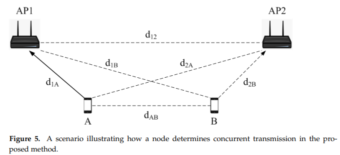

> Original Paper: Kim, H.; So, J. Improving Spatial Reuse of Wireless LAN Uplink Using BSS Color and Proximity Information. Appl. Sci. 2021, 11, 11074. [https://doi.org/10.3390/app112211074](https://www.mdpi.com/2076-3417/11/22/11074)
{: .prompt-info }

## Summary

---

- Propose PSC-UL (Proximity-based Sensitivity Control for UL) to improve spatial reuse in the uplink (UL).
- To sense channel status in terms of a receiver, PSC-UL estimates the distance (i.e., signal attenuation, RSSI) between the receiver and the source of the detected preamble.
- To estimate the distance between the receiver and the source of the detected preamble, a STA uses the distances among neighboring APs and STAs.
- APs and STAs maintain neighbor tables where the RSSI of neighboring APs is stored, and an AP periodically sends its neighbor table to the associated STAs.
- A STA shares the encoded proximity information between the source and destination of a packet by defining a new preamble field.

## Main Idea

---

<!--  -->

Let’s assume that STA B wants to transmit a packet to AP2, and there is an ongoing packet from STA A to AP1.

To determine whether STA B can successfully transmit to AP2, STA B estimates the distance between AP2 and STA A and then estimates the SNR of AP2 using the estimated distance and the distance between STA B and AP2.

In PSC-UL, STA B needs the following distances to estimate the distance between STA A and AP2 ($d_{2A}$):

- the distance between STA A and B ($d_{AB}$)
    - Obtain while detecting the ongoing packet from STA A to AP1
- the distance between STA A and AP1 ($d_{1A}$)
    - Obtain while decoding the preamble of the ongoing packet
- the distance between STA B and AP2 ($d_{2B}$)
    - Obtain when receiving the beacon or DL packets
- the distance between AP1 and AP2 ($d_{12}$)
    - Obtain while AP2 shares its neighbor table
    - APs can obtain the distance between them while receiving beacons

STA B assumes the worst case (the minimum distance between STA A and AP2) and estimates $d_{2A}$ aaccording to the triangle inequality like:

$$
d_{2A} \ge \max(|d_{AB}-d_{2B}|,|d_{12}-d_{1A}|)
$$

Then, STA B estimates its SNR for AP2 by subtracting $d_{2B}$ from $d_{2A}$  and determines the channel is idle when the calculated value exceeds the SNR threshold.

## Comments

---

- Unlike the legacy method, which determines the channel status only using the RSSI of a sender, this method determines the channel status in terms of the receiver, considering the worst-case scenario between the detected interferer and its transmission.
- Due to the characteristics of signal attenuation in wireless communications, the effects of shadowing and multipath fading cause degradation of estimation accuracy (e.g., different obstacles).
- Signaling overhead occurs due to the exchange of neighbor tables.
    - To apply this in downlink, a STA also periodically sends its neighbor tables to its associated AP, causing more signaling overhead.
    - To control this, it might require some trigger frames to exchange neighbor tables.
- A transmitter determines if the channel is idle or busy based on the worst-case scenario, so it is conservative.