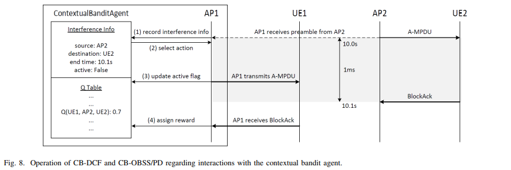

> Original Paper: H. Kim, G. Na, H. Im and J. So, "[Improving Spatial Reuse of Wireless LANs Using Contextual Bandits](https://ieeexplore.ieee.org/abstract/document/10309995?casa_token=qHPGWpUh2BEAAAAA:lQnSeRoWFoOrOQrdRWwFSSfv9TCCF3l8RWmFPwMuTS4uWNTBDP3ZVz4njgpBr1JfR_k6E5xL)," in *IEEE Transactions on Wireless Communications*, vol. 23, no. 7, pp. 6735-6749, July 2024, doi: 10.1109/TWC.2023.3328358.
{: .prompt-info }

To improve upon previous work, we use the Contextual Multi-Armed Bandit (MAB) approach to sense the channel status from the receiver's perspective. By utilizing the Contextual MAB, a sender can experimentally learn the channel status of a receiver, aligning its predictions with the transmission outcomes.

## Summary

---

- We propose a Contextual Multi-Armed Bandit algorithm named CB-DCF to enhance spatial reuse for **downlink** communication.
- Each Access Point (AP) has its own agent with two arms (idle and busy) that determine whether the channel is idle or busy in the current state.
- **The current state** is defined as a tuple consisting of the destination, the interferer, the interferer’s destination, and whether the transmission to its destination was successful.
- **The reward is the result of the transmission**: 1 if the transmission is successful, 0 otherwise.
- Effective spatial reuse aims to maximize concurrent transmissions, making the protection of ongoing packets a critical concern. Therefore, neighboring APs periodically exchange their Q-tables and learn to ensure that both concurrent transmissions are successful.
- To provide information about ongoing packets, an AP indicates the associated STAs by index and adds this information to a **new preamble field** that represents the index of the packet’s destination.
- We also propose a simpler method named CB-OBSS/PD, which only uses the BSS color as the state and adjusts transmission power. We compare this method with CB-DCF.

## Main Idea

---

### Preamble Design

In High Efficiency (HE) operation, the **BSS color** helps nodes differentiate between Basic Service Sets (BSSs) and is typically assigned per AP. Therefore, we use the BSS color to indicate the source of a packet.

In the preamble, there is a new field called the **‘Destination Identifier’** to specify the destination of the packet. An AP assigns indices to associated Stations (STAs) and uses the index of the packet’s destination in the ‘Destination Identifier’. Since we cannot assign an infinite number of indices, we allocate 4 bits for identifying STAs, allowing for 16 indices. The method for assigning these indices is flexible and can be determined by the users.

### CB-DCF Operation

Based on the designed preamble, an agent (i.e., an AP in the downlink) can identify the source and destination of a detected packet, which is considered as interference.

The **state** consists of the identifier of its own destination, the BSS color of the detected preamble, and the destination identifier from that preamble. The agent selects an **action**—whether the channel is idle or busy—based on the current state, using an epsilon-greedy policy. If the selected action indicates that the channel is idle, the agent continues counting down its backoff timer; otherwise, it waits until the detected packet transmission is complete.

When the selected action is idle and the backoff timer reaches zero, the agent transmits the packet. The **reward** is determined by the outcome of the transmission. If the agent receives an acknowledgment (ACK), the action is considered successful, and the reward is set to 1. If the action is unsuccessful, the reward is set to -1. In all other cases, where no transmission occurs, the reward remains 0. The agent then updates the Q-value according to standard Q-learning principles.

Periodically, the APs exchange their Q-tables to share learning.

### Exchanging Q-table

When exchanging Q-tables, an AP updates its Q-value if the Q-value of the counterpart is smaller. This indicates that the counterpart does not benefit from concurrent transmission with the AP itself. Since the goal of improving spatial reuse is to succeed in concurrent transmissions, the AP updates its Q-value accordingly.

### CB-OBSS/PD Operation

In this method, there is no ‘Destination Identifier’ and no exchange of Q-tables. Instead, an agent reduces transmission power, as in OBSS/PD, based on the BSS color. The reward logic remains the same as in CB-DCF.

## Review

---

- Compared to previous work, this approach reduces calculation complexity and improves the accuracy of determining channel status using the Contextual MAB.
- It is more practical than machine learning approaches using a centralized mode.
- When treating the destination identifier as the source and the BSS color as the destination, CB-DCF can also be applied in the uplink.
- There is still signaling overhead caused by exchanging Q-tables.
    - One of the main ideas in IEEE 802.11be is “Multi-AP coordination,” which requires additional transmissions, leading to unavoidable signaling overhead. The key point is to maintain 'moderate' signaling overhead.
- By directly obtaining the Q-tables of neighboring APs, which complements the actions of selfish agents, edge node starvation can be avoided.
    - In terms of learning, directly exchanging Q-values can complicate the convergence of learning. Thus, the epsilon parameter is reduced to zero during learning in the paper.
- One of the key strategies for maximizing concurrent transmission is reducing transmission power to enable more simultaneous transmissions. This can be particularly powerful when transmission power can be adjusted dynamically.
- There are some cases that this method may not cover:
    - Due to the capture effect, the detected interferer for an agent and the actual cause of transmission failure might differ (especially if the cause is further from the agent than the detected interferer).
    - If the cause of transmission failure is not a neighbor of the agent (i.e., not located in the coverage area but close to the destination of the failed packet), the agent may not correctly learn this situation.