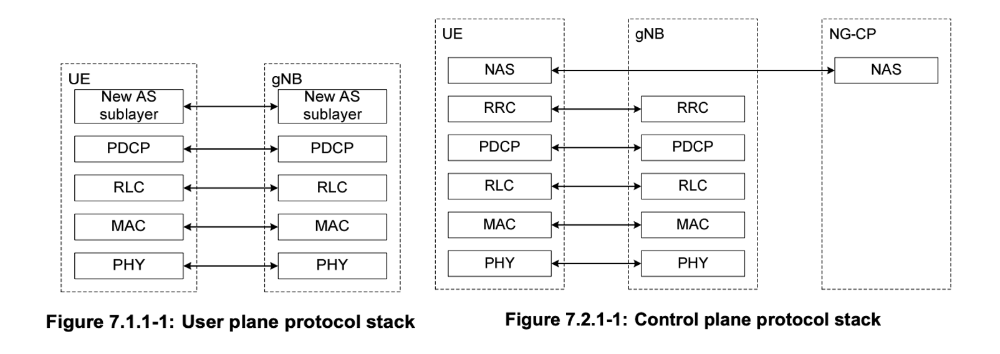
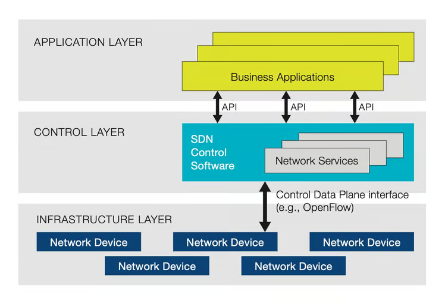
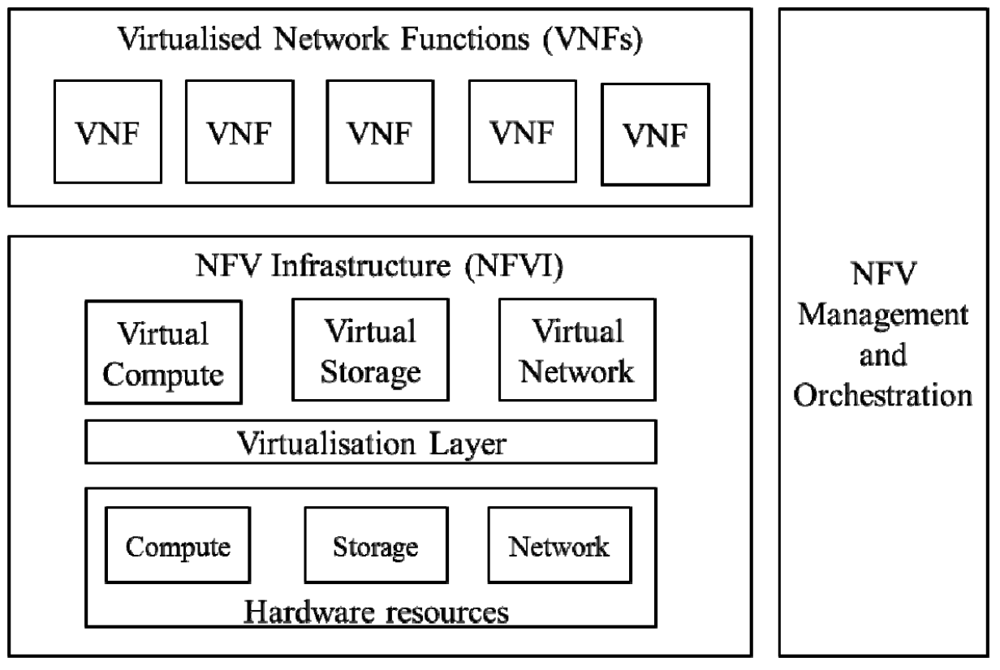
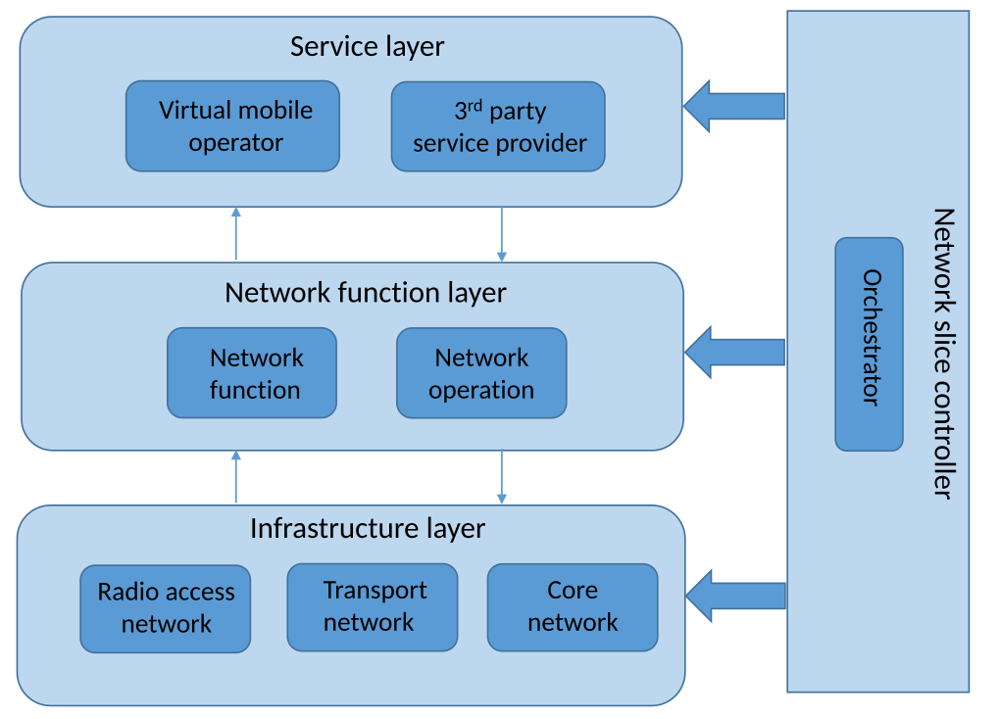
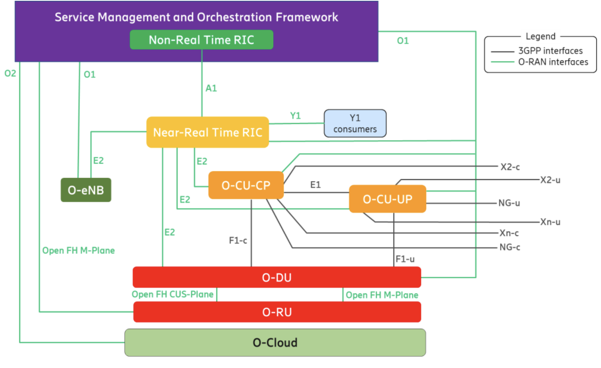
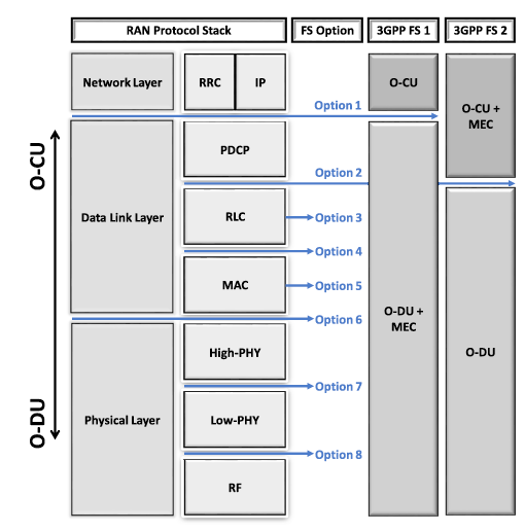
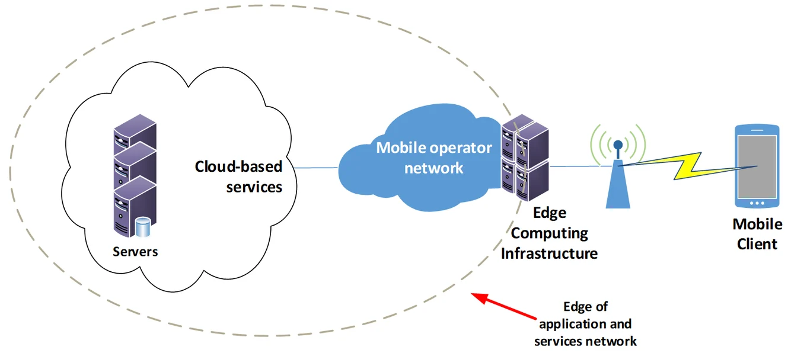
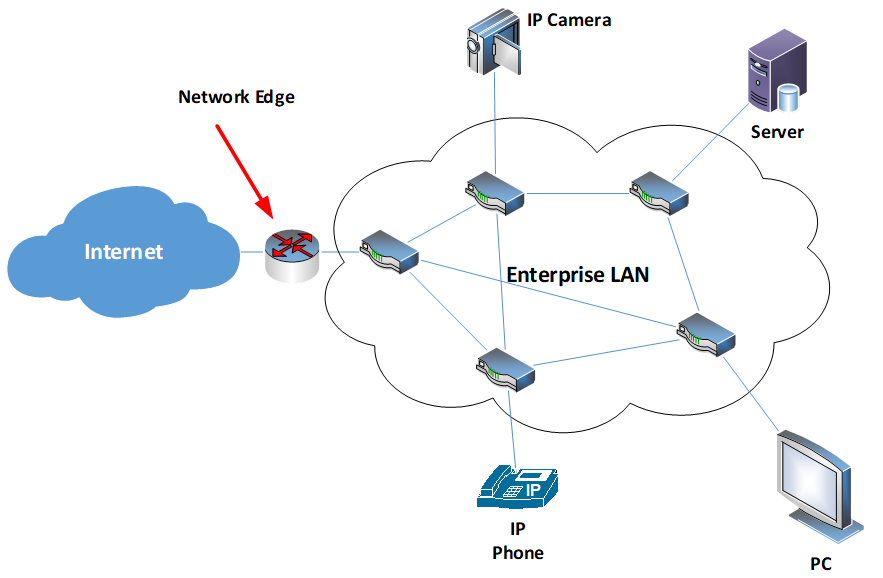

While analyzing the research of B. Ojaghi et al. [1], I found that the concepts forming the background of this paper are also key technologies that constitute 5G and B5G, and are important in V2X as well. Therefore, I decided to write this article to grasp and analyze these concepts as a whole.

Understanding how to flexibly and expansively configure the entire network, and how various companies support services with strict requirements according to standards, can provide the knowledge to build a feasible and efficient network for my use case and resource allocation algorithm, which would be beneficial from a research perspective.

The technologies that will be covered in this post are as follows:

SDN (Software-Defined Networking)
NFV (Network Functions Virtualization)
Open-RAN (O-RAN)
Functional Split (FS)
Mobile Edge Computing (MEC)
Packet Duplication (PD)

## Protocol Stack

---

In Cellular networks, the control plane and data plane are separated. Since resource management and data management for controlling the network system and transmitting data are all handled at the higher layer, we will focus on the higher layer.

### RRC Layer
**Radio Resource Control Layer**: It manages the overall network system, including resources and users.

- **Radio Resource Management**: The RRC is responsible for the allocation and management of radio resources, connection establishment and release, and control functions such as handovers
- **State Management**: The RRC manages the connection states of the UE (User Equipment) and controls state transitions such as Idle and Connected
    - This helps efficiently use network resources and optimize the user experience, particularly in terms of power consumption
- **Signaling Message Transmission**: The RRC transmits control information between the network and user devices

### PDCP Layer

**Packet Data Convergence Protocol Layer**: It receives messages from the upper layers, processes the following functions, and then forwards the data to the lower layers or processes the data received from the lower layers and forwards it to the upper layers.

- **Encryption**: The PDCP layer performs encryption on the data received from the upper layers to ensure data confidentiality.
    - It encrypts user plane data and control plane data using strong encryption algorithms like AES (Advanced Encryption Standard).
- **Header Compression**: It performs header compression to reduce the size of the data, thereby increasing network efficiency.
    - By compressing the headers of IP packets, it reduces the size of the transmitted data, optimizing the use of wireless bandwidth.
    - A representative header compression technique used is **ROHC (Robust Header Compression)**, which compresses headers of IP, UDP, and RTP to enhance transmission efficiency.
- **Data Reordering and Integrity Protection**: It ensures that data is delivered in the correct order and verifies whether the data has been altered through integrity protection.
    - **Packet Sequence Management**: Manages packets so they arrive in the original order they were transmitted.
        - It assigns sequence numbers to each packet and reassembles the received packets based on these sequence numbers.
    - **Retransmission Management**: Handles retransmission requests in case of packet loss.
        - When packet loss is detected, the receiving side sends a retransmission request to the sending side.
        - The sending side retransmits the lost packets, increasing the reliability of data delivery.
    - **Duplicate Elimination**: Performs a duplicate elimination function to prevent the same data from being transmitted multiple times.
        - This reduces the waste of network resources and enhances transmission efficiency.
        - Duplicate elimination is performed based on the sequence numbers of the data in the PDCP layer.
    - **Integrity Protection**: Ensures that data is not altered during transmission.
        - It uses message integrity checks (MAC, Message Authentication Code) to verify data integrity.
        - This helps detect whether the data has been tampered with and prevents manipulation during transmission.
- **QoS (Quality of Service) Management**: The PDCP manages the prioritization of network traffic to meet the needs of various services.
    - For example, delay-sensitive traffic like real-time voice calls can be prioritized over bandwidth-intensive traffic like video streaming.

### RLC Layer

**Radio Link Control Layer**: Processes data received from the upper layers for transmission and handles the transmitted data received from the lower layers.

- **Data Segmentation and Reassembly**: The RLC splits data received from the upper layer (PDCP) into transmittable-sized data units and reassembles received data back into its original size.
- **Error Correction and Retransmission**: The RLC detects errors that may occur during data transmission and requests retransmission of lost data, ensuring data reliability.
- **Flow Control**: The RLC controls the flow of transmitted data, adjusting the rate between sender and receiver to prevent network congestion.

#### Operating Modes

- **AM (Acknowledged Mode)**: Supports error detection and retransmission to ensure highly reliable data transmission.
- **UM (Unacknowledged Mode)**: Designed for fast data transmission without error correction, mainly used for real-time services.
- **TM (Transparent Mode)**: Provides simple data forwarding functionality, mainly used for transmitting control information.

## SDN (Software-Defined Networking)

---
 
> How to flexibly configure the equipment? (Control Function)
{: .prompt-tip }

In traditional networking equipment, the Control Plane (CP) and User Plane (UP) conceptually performed separate functions, but physically they coexisted within the same network device, such as switches and routers.

**SDN** is a technology that physically separates the network's control function from the data transmission function, implementing it in software so that the intelligent control of the network can be centrally managed through software.

### Origin

Companies like CISCO developed generic hardware and then installed specific software in ROM to meet user requirements, allowing them to sell the equipment more flexibly and efficiently.

- The software defines the functions of network devices like wired/wireless APs, routers, etc.
- In the past, when the standard was updated, the equipment itself had to be newly manufactured, but by implementing it in software, only software updates are needed.
- With advancements in hardware performance like GPUs, multiple software programs can be installed and run in parallel, allowing the execution of various software according to the purpose.

### Architecture

{: width="80%"}
_[https://www.sdxcentral.com/networking/sdn/definitions/what-the-definition-of-software-defined-networking-sdn/](https://www.sdxcentral.com/networking/sdn/definitions/what-the-definition-of-software-defined-networking-sdn/)_

In SDN (Software-Defined Networking), the **Northbound API** and **Southbound API** are responsible for interactions between the SDN controller and other systems.

- **SDN Controller**: Software responsible for the entire control logic of the network, managing network topology, traffic engineering, policy enforcement, etc., instead of network devices like switches and routers.
- **Open Protocols**: Uses protocols like OpenFlow to enable communication between the SDN controller and network devices.
- **Northbound API**: Manages communication between the SDN controller and applications. This allows network applications to interact with the controller to control and monitor the network's operation.
    - The SDN controller can automatically ensure application traffic is routed according to policies established by network administrators.
    - Via the northbound APIs, applications tell the layer what resources the applications need and their destination.
    - The control layer orchestrates how the applications are given the resources available in the network.
- **Southbound API (Control Data Plane Interface)**: Manages communication between the SDN controller and network devices (switches, routers, etc.). It primarily uses open protocols like OpenFlow to control network devices and set paths for data transmission.
    - The network infrastructure is told what path the application data must take as decided by the controller.
    - In real-time, the controller can change how the routers and switches are moving data.

### Expected Effects

The core of SDN lies in the physical separation of the Control Plane and Data Plane. In SDN, the Control Plane is managed by a centralized SDN controller, while the Data Plane is executed by network devices (switches, routers, etc.).

- **Centralization of the Control Plane**: The Control Plane is centralized to the SDN controller.
    - The SDN controller processes the entire network's control logic in software and makes policy and routing decisions for the network devices.
- **Independence of the Data Plane**: The Data Plane devices perform packet transmission tasks without performing control functions themselves.
    - It is executed on physical network devices (switches, routers, etc.), which forward data packets according to the instructions received from the SDN controller.

This provides the following benefits:

- **Centralized Control**: The entire network can be centrally managed and controlled.
- **Programmability**: Network policies and functions can be defined and changed in software.
- **Flexibility**: The network can be dynamically configured and traffic flows can be adjusted.

### Advantages of Physical Separation

- **Increased Flexibility**: Since the entire network can be controlled centrally, traffic paths, policy settings, etc., can be dynamically changed.
- **Simplified Management**: Network administrators can easily monitor and manage the entire network through a centralized system (SDN controller).
- **Rapid Deployment and Scalability**: New network functions or services can be introduced software-wise, enabling rapid deployment without the need for physical equipment replacement.
- **Cost Efficiency**: By using standardized hardware and open-source software, network construction and operation costs can be reduced.

### Advantages of Software Definition

- **Programmability**: Network policies and control logic can be implemented in software, allowing interaction with various protocols. This enables network operators to more easily modify the network's operation and add new features.
- **Standardization and Interoperability**: Open protocols provide standardized rules that allow equipment from various manufacturers to communicate in the same way. This ensures that different components of the network can work together.
- **Flexibility**: Thanks to software-based control, network administrators can dynamically adjust network settings as needed and optimize traffic flow.

### Implementation of the SDN Controller

The SDN controller is the centralized control point of the network, implemented on physical or virtualized infrastructure. The specific deployment location can vary depending on the scale, requirements, and architecture of the network and can be located in centralized data centers, edge networks, dedicated hardware devices, or virtualized environments. This allows network operators to control and manage the network from the most optimal location.

1. **Data Center**
    - **Centralized Deployment**: The SDN controller is typically installed on servers within the data center.
        - Data centers provide high-performance computing resources, large-scale storage, and fast network connections, making them suitable environments for managing and controlling many network devices.
    - **Cloud Environment**: Cloud service providers can deploy the SDN controller as part of the cloud infrastructure.
        - This allows flexible management of cloud networks, ensures quality of service (QoS), and meets diverse customer needs.
2. **Edge Network**
    - **Distributed Deployment**: In some cases, the SDN controller can be deployed in the edge network.
        - This is useful for reducing latency and efficiently managing regional network traffic.
        - In edge computing environments, the physical distance to the user is shortened, which can reduce network response times.
3. **Dedicated Network Equipment**
    - **Network Appliance**: The SDN controller can also be provided as a dedicated hardware device (network appliance).
        - These devices integrate optimized hardware and software to perform SDN functions.
4. **Virtualized Environment**
    - **Virtual Machine or Container**: The SDN controller can also be deployed in a virtualized environment.
        - SDN controllers running as virtual machines (VMs) or containers provide scalability and mobility similar to cloud-native applications.
        - This approach allows the SDN controller to be flexibly deployed and managed.
5. **Hybrid Environment**
    - **On-Premises and Cloud**: In a hybrid deployment model, the SDN controller can span both on-premises data centers and cloud environments.
        - This enables consistent network management and policy enforcement by integrating on-premises networks with cloud-based resources.

## NFV (Network Functions Virtualization)

---

> How to flexibly and scalably configure the functions needed for the network?
{: .prompt-tip }

Network Function Virtualization (NFV) is a technology that virtualizes **Network Functions (NFs)** (e.g., load balancer, firewall, DPI) as **software**.

In other words, it implements network functions (NF) as software that runs in a virtualized environment. This allows it to run on general-purpose hardware, rather than being dependent on specific hardware.

### Architecture

{: width="80%"}

- **VNF (Virtual Network Function)**: The software application that delivers a NF, such as forwarding services and IP configurations.
    - Multiple VNFs can be combined to form a service chain.
    - The chained VNFs are running over the NFVI.
    - Based on the standardized architecture of NFVI, VNFs can run independently of hardware.
- **NFV Infrastructure (NFVI)**: The physical or virtual infrastructure where VNFs are deployed and executed, including computing, storage, and network resources.
- **MANO (Management and Orchestration)**: The component responsible for the overall management and orchestration of NFV, supporting automated deployment, management, and scaling of network services.
    - **VNF Combination and Chain Formation**: VNFs are selected and combined to form service chains according to service requirements.
    - **NFVI Management**: Manages the allocation and management of virtualized infrastructure resources.
    - **Automation and Orchestration**: Automates and coordinates the deployment, configuration, scaling, and maintenance of network services.
        - The formed service chains are deployed and managed through the NFVI.

### Network Function (NF)

A Network Function (NF) refers to a software or hardware component that performs a specific role in the network. Examples of key NFs used in network architecture include:

1. **AMF (Access and Mobility Management Function)**:
    - Manages user access and mobility, including UE authentication, mobility management, and connection setup and release.
2. **SMF (Session Management Function)**:
    - Handles session management, including session setup, modification, release, and IP address allocation.
3. **UPF (User Plane Function)**:
    - Processes data packet transmission in the user plane, handling traffic processing, QoS enforcement, and user data path selection.
4. **PCF (Policy Control Function)**:
    - Manages network policies and enforces QoS and charging policies.
5. **NRF (Network Repository Function)**:
    - Stores and manages all NFs in the network, supporting the discovery and exploration of NFs.
6. **NSSF (Network Slice Selection Function)**:
    - Manages network slice selection, selecting the appropriate network slice for specific services.
7. **RRC (Radio Resource Control)**:
    - Performs radio resource control and management functions, managing the setup and release of radio bearers.
8. **PDCP (Packet Data Convergence Protocol)**:
    - Handles data packet processing, including compression, encryption, and integrity protection.
9. **RLC (Radio Link Control)**:
    - Performs data transmission and retransmission functions to ensure the reliability of the radio link.
10. **MAC (Medium Access Control)**:
    - Manages access to the wireless channel, controlling the sharing of the channel among multiple users.

These NFs operate at various layers of the network and play crucial roles in managing and optimizing communication between the user and the network.

### Deployment and Implementation Examples

The virtualized services in the NFV architecture can be deployed in various locations.

1. **Data Center**:
    - **vEPC (Virtual Evolved Packet Core)**: A core component of mobile networks that processes data traffic and manages user sessions. For example, a vEPC deployed in a data center manages data connections for numerous user devices and processes traffic.
    - **vIMS (Virtual IP Multimedia Subsystem)**: Supports multimedia services (voice, video, messaging, etc.), providing a centralized approach to delivering various media services from the data center.
    - **vFirewall**: A virtual firewall deployed in the data center monitors and protects network traffic by enforcing security policies.
2. **Edge Cloud (Near Base Stations)**:
    - **vRAN (Virtual Radio Access Network)**: Virtualizes radio signal processing near the base station, reducing the physical distance to users and processing real-time traffic. For example, a vRAN deployed in an edge cloud can optimize network performance in high-density user areas by providing additional resources.
    - **MEC (Multi-access Edge Computing)**: MEC servers are deployed near base stations to provide low-latency applications. For example, in applications such as autonomous driving that require low-latency, MEC is located close to the base station to enable rapid data processing.
3. **Customer Premises**:
    - **vCPE (Virtual Customer Premises Equipment)**: Deployed at the customer's premises to provide functions such as VPN, firewall, and routing, and can be remotely managed from the cloud. This approach virtualizes the network functions needed by the customer, making installation and management easier.
4. **Cloud Infrastructure**:
    - **Public Cloud**: NFV functions are deployed in public cloud environments such as Amazon Web Services (AWS), Google Cloud Platform (GCP), and Microsoft Azure, providing high scalability and global accessibility.
    - **Private Cloud**: NFV functions are deployed in private cloud environments used within enterprises, enhancing security and control.
5. **Distributed Data Centers**:
    - NFV functions can be deployed across multiple distributed data centers to provide optimal performance for geographically dispersed users. This ensures data redundancy and availability across various regions.

### Advantages

- **Cost Reduction**: Use of general-purpose servers instead of dedicated hardware.
- **Flexibility**: Rapid deployment and updates of network functions.
- **Scalability**: Flexible allocation and scaling of resources as needed.

### NFV and SDN

- NFV focuses on virtualizing the network functions themselves, allowing these functions to run independently in a virtualized environment.
- SDN implements the control and management of the network in software, enabling centralized control of network operations.

**NFV** virtualizes network functions in software, while **SDN** controls and manages the network where these functions operate in software.

When used together, NFV and SDN can greatly enhance the flexibility and efficiency of the network. For example, an SDN controller can control and manage virtual network functions running in the NFV infrastructure.

## Network Slicing

---

Network Slicing is a technology that divides a single physical network infrastructure into multiple virtual slices utilizing NFV and SDN.

- NFV virtualizes physical network functions, allowing various virtual network functions (VNFs) to run on general-purpose hardware.
- SDN centralizes network control, enabling software-based control and management of network traffic.

### Architecture

{: width="80%"}
_[https://en.wikipedia.org/wiki/5G_network_slicing](https://en.wikipedia.org/wiki/5G_network_slicing)_

- **Service Layer**:
    - This layer includes the applications and service providers that deliver services to end users.
        - For example, virtual mobile operators (VMO) or third-party service providers are located here.
    - This layer provides optimal services to users through network slices.
- **Network Function Layer**:
    - This layer provides various network functions in a virtualized form, responsible for network control and operation.
        - VNFs are deployed using **NFV technology**, and traffic is managed through the SDN controller.
        - The NFV orchestrator configures network slices by deploying, managing, and combining these VNFs.
- **Infrastructure Layer**:
    - This layer includes the physical network infrastructure (Radio Access Network, Transport Network, Core Network).
    - Physical resources are virtualized to support network slices, and network resources are managed software-wise through **SDN technology**.
    - The SDN controller sets the path of network traffic and controls various network components such as the **Radio Access Network**, **Transport Network**, and **Core Network** to manage the traffic flow of the slice.
- **Network Slice Controller**:
    - The network slice controller manages the integration of the above layers, performing roles such as slice creation, configuration, and monitoring.
    - It optimizes network resources by reflecting various service requirements and manages the lifecycle of the slice.

### Key Features

- **Virtual Network Slices Based on Traffic Requirements**:
    - The physical network is logically divided to create virtual networks tailored to the requirements of different services or applications.
    - Each slice is managed independently and can be designed to meet or optimize the QoS (Quality of Service) requirements of different services or use cases.
        - For example, a slice for autonomous vehicles must ensure ultra-low latency and high reliability, while a slice for large-scale video streaming requires high bandwidth.
- **Slice-specific Customization**:
    - Through **NFV**, the necessary network functions (VNFs) for each slice can be provided in a virtualized form.
        - For example, Slice A may have a set of VNFs for low-latency traffic, while Slice B may have a set of VNFs to handle traffic requiring high bandwidth.
    - **SDN** allows the software-based control of network traffic routing and manages traffic flow for each slice.

### Slice Management Method

- **Resource Allocation by Slice**: Each slice is independently allocated computational resources, storage, bandwidth, etc., of the network. This provides efficient use and easy management of network resources.
- A single network slice is managed by both **NFV's MANO** and the **SDN controller**. These two systems perform different roles while optimizing the functions and performance of the slice.
    - **MANO** handles the deployment, resource allocation, and lifecycle management of the VNFs in each slice. This ensures that each slice is provided with the necessary functions and can operate efficiently. (Slice Management and Orchestration)
    - The **SDN controller** manages the control plane of the network, handling tasks such as traffic path setting, QoS management, and policy enforcement within the slice.

### Advantages of Network Slicing

- **Guaranteed Service Quality**: Each slice is designed to meet the requirements of specific services, enhancing the user experience.
- **Flexibility and Efficiency**: Network resources can be dynamically allocated and optimized according to the needs of different services.
- **Cost Savings**: Operating multiple virtual networks on a single physical infrastructure reduces network construction and operation costs.

## Open-RAN (O-RAN)

---

> Adding flexibility to layer operation by making network layers interface-based and "open."
{: .prompt-tip }

O-RAN (Open Radio Access Network) is a concept aimed at enhancing the flexibility and efficiency of communication networks by designing the Radio Access Network (RAN) in an open and interoperable structure. **O-RAN is implemented by combining traditional RAN architecture with Software-Defined Networking (SDN) and Network Functions Virtualization (NFV).**

### Key Features

The key features of O-RAN are as follows:

1. **Open Interfaces**: O-RAN uses open interfaces to ensure interoperability between equipment and software from various vendors.
   - This allows network operators to mix and match solutions from different vendors without being locked into a specific vendor's ecosystem.
2. **Virtualization and Software-Defined Networking**: O-RAN enhances the flexibility and scalability of the network through virtualization of network functions.
   - Centralized control and management are enabled via Software-Defined Networking, which allows for efficient allocation of network resources.
3. **Modularity**: O-RAN's architecture modularizes network functions, enabling independent development and deployment of each function.
   - This facilitates rapid addition or updating of new features.
4. **Support for Diverse Network Slicing**: O-RAN can configure networks that meet diverse service requirements through network slicing.
   - For example, it can provide network slices that meet the QoS requirements of services such as autonomous vehicles, smart cities, and AR/VR.
5. **Cost Savings and Efficiency Improvements**: By leveraging commercial hardware and open-source software, O-RAN can reduce network deployment and operational costs while integrating solutions from various vendors to achieve optimal performance.

In summary, O-RAN aims to significantly enhance the efficiency and flexibility of communication networks by transitioning from a closed, vendor-dependent RAN structure to an open and flexible architecture.

### O-RAN Architecture Overview

{: width="80%"}
_[https://mediastorage.o-ran.org/white-papers/O-RAN.WG1.Vertical-Industry-White-Paper-2023-12.pdf](https://mediastorage.o-ran.org/white-papers/O-RAN.WG1.Vertical-Industry-White-Paper-2023-12.pdf)_

Break down hardware-centric RAN, making it more open, interoperable, and standardized interfaces to communicate with, manage, and collect data from each network node, known as the set of **Next Generation Node Bs (gNBs).**

The gNB is composed of **three primary elements**: O-CU, O-DU, and O-RU.

- **O-CU**: O-RAN Central Unit
   - A logical node hosting higher-layer protocols such as RRC, SDAP, and PDCP.
   - **Location**: Typically deployed in a centralized location within the network, near a data center or network core, and connected to multiple O-DUs.
      - **Placed to manage all base stations centrally.**
   - **Role**: Handles control plane and user plane functions related to the PDCP layer, allowing for efficient management and resource allocation of the network by being centrally located.
      - **Control and Management Functions**: O-CU performs network control plane functions such as session management, mobility management, and resource allocation for all UEs connected to the base stations, coordinating them centrally.
      - **Efficient Resource Utilization**: By managing multiple base stations (O-DU and O-RU), the O-CU enables efficient use of network resources, dynamically allocating them based on traffic patterns and service requirements.
      - **QoS Maintenance**: Centralized management of all base stations ensures consistent QoS and allows for optimization across the entire network.
      - **Scalability and Flexibility**: The O-CU provides flexibility to scale or shrink the network based on changing requirements, especially when using cloud-based infrastructure.
- **O-DU**: O-RAN Distributed Unit
   - A logical node hosting RLC/MAC/High-PHY layers based on a lower-layer functional split.
   - **Location**: Typically deployed near the base station, as close as possible to the user devices to minimize latency.
   - **Role**: Handles baseband processing, including RLC, MAC, and upper PHY layer functions. The O-DU manages radio resources and processes user data, connecting to multiple O-RUs.
- **O-RU**: O-RAN Radio Unit
   - A logical node hosting Low-PHY layer and RF processing based on a lower-layer functional split. This is similar to 3GPP’s “TRP” or “RRH” but more specific in including the Low-PHY layer (FFT/iFFT, PRACH extraction).
   - **Location**: The O-RU is placed close to the physical structure of the base station, such as the antenna, where actual radio signal transmission and reception occur.
   - **Role**: Handles the lower PHY layer, performing tasks such as modulation, FFT/iFFT, and beamforming. The O-RU directly communicates with user devices, transmitting and receiving radio signals.

### Backhaul Network

The **Backhaul Network** in **O-RAN** refers to the connection between the **Centralized Unit (O-CU)** and the core network. This network is essential for transmitting control and user data from the O-CU to the core network, meeting the demands for high-speed data transmission and low latency.

- **Data and Control Information Transmission**: The Backhaul handles not only user data but also network control information, such as handover control and QoS management, supporting efficient network management and UE mobility.
- **High-Speed Data Processing**: In 5G networks, high bandwidth is required, and the Backhaul link supports this by providing transmission speeds of up to tens of Gbps.
- **Network Redundancy and Reliability**: The Backhaul network offers redundancy through multiple links, ensuring that data transmission continues even if a particular link fails, thereby enhancing network reliability.

The backhaul typically involves high-capacity fiber optic links or microwave connections that can support the large volumes of data and strict latency requirements of 5G networks ([Intel](https://www.intel.com/content/dam/www/public/us/en/documents/white-papers/exploring-5g-fronthaul-network-architecture-white-paper.pdf#:~:text=URL%3A%20https%3A%2F%2Fwww.intel.com%2Fcontent%2Fdam%2Fwww%2Fpublic%2Fus%2Fen%2Fdocuments%2Fwhite)) ([5G Training and 5G Certification](https://www.5gworldpro.com/blog/2022/05/15/what-is-difference-in-5g-between-fronthaul-midhaul-and-backhaul/)).

### Midhaul Network

In O-RAN, the **F1 interface** is used to transmit data between the **Central Unit (CU)** and the **Distributed Unit (DU)**. The F1 interface is divided into two main components: **F1-C** and **F1-U**.

1. **F1-C (Control Plane)**: This interface handles control plane data, including functions such as connection setup, resource management, and handover. It enables signaling processing and control message exchange between the CU and DU.
2. **F1-U (User Plane)**: This interface is responsible for transmitting user plane data, primarily the actual user data (e.g., internet traffic, video streaming). The data processed by the PDCP (Packet Data Convergence Protocol) layer is transmitted through F1-U.

The F1 interface forms part of O-RAN's **midhaul**, which manages end-to-end data transmission through the connection between the CU and DU, ensuring network reliability and performance. By separating user and control data, the F1 interface optimizes data flows and enhances network efficiency ([5G Technology World](https://www.5gtechnologyworld.com/how-do-open-ran-interfaces-work/)) ([ar5iv](https://ar5iv.org/pdf/2011.03734)) ([RCR Wireless News](https://www.rcrwireless.com/20200708/fundamentals/open-ran-101-ru-du-cu-reader-forum)).

### Fronthaul Network

The Fronthaul network connects the **O-RU (O-RAN Radio Unit)** to the **O-DU (O-RAN Distributed Unit)**. This network segment handles the transport of data and control information between the radio units located at cell sites and the distributed units, which are responsible for baseband processing tasks.

1. **From DU to RU**:
   - The DU performs many tasks related to baseband processing, including channel coding, error correction, and scheduling.
   - The DU sends this information and scheduled resource allocation information to the RU, which is necessary for the RU to determine how to use radio resources (e.g., frequency, time slots).
2. **From RU to DU**:
   - The RU handles actual radio signal processing and performs tasks related to transmission and reception in the physical layer.
   - The RU converts the received radio signal into a digital signal and sends information about it (e.g., UE status, channel quality) to the DU. 
   - This information is used by the DU to optimize scheduling and resource allocation decisions.

The O-RAN architecture introduces an open and standardized fronthaul interface, such as the 7.2x split, which simplifies the deployment of RUs and DUs by providing a clear division of tasks. This split typically leaves simpler tasks, like FFT and cyclic prefix processing, to the RU, while more complex baseband processing functions are handled by the DU ([ar5iv](https://ar5iv.org/pdf/2202.01032)) ([5G Training and 5G Certification](https://www.5gworldpro.com/blog/2022/05/15/what-is-difference-in-5g-between-fronthaul-midhaul-and-backhaul/)).

The fronthaul is a critical link that ensures fast and efficient data transmission between these two units. It is implemented with high-performance network connections (e.g., fiber optics) to maintain high data transfer rates and low latency between the DU and RU. This structure provides flexibility and scalability to the network and is essential for high-speed, low-latency services like 5G.

### Low-PHY and High-PHY

In O-RAN architecture, the distinction between **High-PHY** and **Low-PHY** is primarily based on the specific functions and computational intensity of the tasks each handles. This distinction is part of the functional split options defined by O-RAN, particularly in the option 7-2 split, which aims to optimize the division of labor between different units in the RAN.

#### Low-PHY
The **Low-PHY** layer is typically implemented in the **O-RU (O-RAN Radio Unit)** and is responsible for less computationally intensive tasks. Some of the primary functions of the Low-PHY layer include:
- **FFT/iFFT**: Fast Fourier Transform and Inverse FFT are used for converting time-domain signals to frequency-domain and vice versa.
- **CP Removal/Add**: Cyclic Prefix removal and addition are essential for dealing with inter-symbol interference in OFDM systems.
- **Digital Beamforming**: This involves processing signals from multiple antennas to focus the transmission/reception in specific directions.
- **PRACH Processing**: Handles the Physical Random Access Channel for initial network access ([TMS Emerson](https://www.ni.com/en/solutions/semiconductor/wireless-infrastructure-development/introduction-o-ran.html)) ([RCR Wireless News](https://www.rcrwireless.com/20210317/5g/exploring-functional-splits-in-5g-ran-tradeoffs-and-use-cases-reader-forum)) ([Moniem-Tech](https://moniem-tech.com/2022/03/13/why-7-2x-split-is-the-best-split-option/)).

#### High-PHY
The **High-PHY** layer, usually managed by the **O-DU (O-RAN Distributed Unit)**, takes on more computationally intensive tasks. Key functions include:
- **Channel Coding/Decoding**: Involves error correction coding to protect data during transmission.
- **Modulation/Demodulation**: Converting digital data into analog signals for transmission and vice versa.
- **Precoding**: Optimizes MIMO transmissions by managing multiple data streams to minimize interference.

#### Advantages

The distinction is made based on the processing capabilities required for each function and the latency sensitivity.

By placing less demanding tasks in the O-RU and more complex tasks in the O-DU, O-RAN can optimize resource allocation, reduce latency, and improve overall network performance ([RCR Wireless News](https://www.rcrwireless.com/20210317/5g/exploring-functional-splits-in-5g-ran-tradeoffs-and-use-cases-reader-forum)) ([Techlteworld](https://techlteworld.com/7-2x-split-o-ran-fronthaul/)).

This division allows for more flexible and efficient network deployment, enabling operators to optimize their infrastructure based on specific use cases and requirements.

### Design Challenge

- Each node has a logically defined role, but in practice, functions can be flexibly assigned according to network requirements.
- Therefore, optimizing the placement based on the network environment and service requirements becomes a crucial consideration.

## Functional Split (FS)

---

Functional Split (FS) refers to various methods that can be used to distribute or centralize network functions. FS determines where specific network functions are located and how they are implemented. This allows for flexible design and deployment of network architecture and enables optimizing the placement based on the network environment and service requirements.

### Types

- **Centralized Split**: Most of the network's functions are handled in a centralized data center or server.
  - This can increase resource usage efficiency, but it may also result in latency.
- **Distributed Split**: Network functions are distributed across multiple locations.
  - For example, some data processing is performed near the base station, while the rest is handled centrally.
  - This approach can reduce latency, but it may also increase the complexity of management.

### FS in O-RAN

{: width="85%"}

- The degree of centralization can be adjusted to balance resource usage efficiency and latency.
- In O-RAN (Open Radio Access Network), FS is designed to be more flexible in its application.
- Network operators can decide whether to perform functions centrally or at distributed locations, such as base stations, based on specific use cases.
- This allows the architecture to be adjusted according to the performance requirements of specific services or network conditions.
- In other words, the process of deciding where to place each function (O-CU, O-DU, O-RU) within the network is crucial for optimizing the network's performance, flexibility, and cost-efficiency.

#### High-Level vs. Low-Level Split
- **High-Level Split**: Centralizes higher-level functions, including the control plane and user plane, in the O-CU while placing lower-level functions (e.g., radio signal processing) in the O-DU or O-RU. This approach facilitates efficient resource management and network control through centralized control. *→ A form of Centralized Split*
- **Low-Level Split**: Places more functions in the distributed O-DU or O-RU, reducing latency with user equipment (UE) and enabling distributed data processing. This approach improves user experience and optimizes resource allocation based on local user density. *→ A form of Distributed Split*

#### Specific Functional Split Options
- **Option 2**: PDCP/RLC split, with PDCP managed at the O-CU and RLC and MAC managed at the O-DU.
- **Option 3**: Intra-PHY split, with PDCP, RLC, and MAC managed at the O-CU, while the lower part of the PHY layer is handled at the O-DU.
- **Option 7**: Split within the PHY layer, allowing fine-grained distribution of functions among the O-CU, O-DU, and O-RU.

> ℹ️ **Relevant Standard Documents for Specific Functional Split Options**
  - **3GPP TS 38.401**: This document defines the structure and functions of the 5G NR network. It describes options for functional splits (F1 interface) between the Central Unit (CU) and Distributed Unit (DU).
  - **3GPP TS 38.300**: This document outlines the overall system architecture of 5G NR, including various functional split options, detailing where user plane and control plane functions can be located.

### Criteria for Choosing a Functional Split

- **Network Performance**: Considerations include user traffic processing, minimizing latency, and network throughput.
- **Quality of Service (QoS)**: Functions should be placed at optimal locations to meet the varied requirements of different services.
- **Cost-Efficiency**: Strategic placement is necessary to reduce network deployment and operational costs.
- **Flexibility and Scalability**: The chosen split should ensure network scalability and operational flexibility.

### NFV and O-RAN

In the O-RAN architecture, VNFs (Virtual Network Functions) are distributed based on the specific functions each unit performs. The choice of FS determines which layers are assigned to each unit, and the NF associated with each layer is virtualized and allocated accordingly.

O-RAN uses flexible FS to deploy NFs appropriately, depending on the diverse service requirements, thus offering tailored services.

### Importance

Custom functional splits play a critical role in optimizing network efficiency, performance, and cost. In next-generation networks like B5G, flexible split strategies are essential for meeting various service demands.

## Mobile Edge Computing (MEC)

---

_[https://info.teledynamics.com/blog/network-edge-vs-edge-computing](https://info.teledynamics.com/blog/network-edge-vs-edge-computing)_

MEC (Multi-access Edge Computing) is a technology that provides computing, storage, and network functions at the network edge. This technology allows for processing and analyzing data close to the user, significantly reducing latency, increasing data transmission efficiency, and optimizing network traffic.

### Network Edge

{: width="80%"}
_[https://info.teledynamics.com/blog/network-edge-vs-edge-computing](https://info.teledynamics.com/blog/network-edge-vs-edge-computing)_

The network edge refers to the part of the network located between user devices (e.g., smartphones, IoT devices) and the network core (central data centers or cloud servers). Because the network edge is close to where data is generated and consumed, processing data at the edge plays a crucial role in minimizing latency and enhancing network efficiency.

For example, base stations, local data centers, and gateways are considered part of the network edge, where data processing occurs to support real-time services such as autonomous driving, AR/VR, and smart cities.

### Key Features

- **Reduced Latency**: By processing data at the edge, the need to route data through the network core is eliminated, significantly reducing latency.
    - This is crucial for **real-time applications** like autonomous vehicles, augmented reality (AR), and virtual reality (VR).
- **Traffic Offloading**: By processing data at the network edge, the amount of traffic sent to the core network can be reduced.
    - This optimizes network bandwidth usage and improves overall network efficiency.
- **Local Data Processing**: MEC enables the processing of sensitive data locally, enhancing security and helping to comply with data protection regulations.

### Relationship Between MEC and NFV

1. **Virtualized Network Functions**: MEC virtualizes computing, storage, and network resources through VNFs (Virtual Network Functions) running at the network edge. For example, local caching, data analytics, and content delivery network (CDN) functions can be provided as VNFs in a MEC environment.
2. **Flexible Deployment and Management**: Through NFV orchestration (MANO), VNF deployment, management, and scaling can be handled on the MEC platform. This allows service providers to manage resources in real time and adjust the quality of service (QoS) to meet user demands.
3. **Real-time Service Delivery at the Edge**: MEC performs data processing at the network edge, reducing latency and enabling real-time services such as AR/VR and autonomous driving. This approach leverages the benefits of NFV's virtualization and resource efficiency at the edge.

### Joint O-RAN and MEC Architecture

One of the major challenges in combining O-RAN and MEC architectures is deciding the placement of RAN functions and the integration of MEC. This involves determining the extent to which RAN functions should be combined with MEC and where specific functions should be located.

MEC (Multi-access Edge Computing) provides computing, storage, and network functions at the network edge to reduce latency and improve data transmission efficiency. MEC can be integrated with RAN in the following ways:

- **Integration with O-DU**: This approach minimizes the physical distance to the user, reducing latency and making it suitable for real-time data processing applications such as autonomous driving and AR/VR.
- **Integration with O-CU**: This approach utilizes higher bandwidth and computing resources in a centralized location, making it suitable for centralized data processing and management.

#### Where to deploy MEC

The decision of where to deploy MEC is critical, with two main options:

1. **Edge close to O-DU (O-RAN Distributed Unit)**: This method places MEC near Vehicle UEs (VUEs), meeting latency and computing requirements. In this case, MEC is physically closer to the user, making it suitable for services requiring real-time responses.
2. **Integration with O-CU (O-RAN Central Unit)**: Deploying MEC with the O-CU allows for handling higher bandwidth and computing requirements, with latency kept at an acceptable level. This approach is advantageous for coordinating VUEs in a more centralized manner and handling large data volumes.

The choice depends on the service characteristics and requirements provided by the network operator. For example, services like autonomous vehicles require extremely low latency and real-time data processing, making MEC deployment closer to the O-DU beneficial. Conversely, services that require high bandwidth may benefit from integration with the O-CU to improve processing efficiency.

## Packet Duplication (PD)

---

Packet Duplication (PD) is a technology introduced in Rel. 15 and 16, applied in the PDCP (Packet Data Convergence Protocol) layer of 5G NR to ensure data packet reliability and low latency.

### Operation of Packet Duplication

- **Packet Duplication Transmission**: In the PDCP layer, the same packet (PDU, Packet Data Unit) is duplicated and sent over multiple paths.
    - Each duplicated packet has the same PDCP sequence number, indicating that the packet has been duplicated.
    - These duplicated packets are transmitted through two independent RLC/MAC entities.
- **Duplicate Packet Handling**: When the receiving PDCP layer detects duplicate packets, it removes them.

### Packet Duplication Configuration Process

- To transmit duplicated PDCP PDUs, the RRC adds at least one secondary RLC entity to a radio bearer when duplication is configured.
    - The same PDCP PDU can therefore be sent in two copies.

### Packet Duplication Scenarios

**The location of the secondary RLC entity** depends on the scenario in which the PDCP packet duplication function is activated.

#### Dual Connectivity (DC)-based PDCP duplication

The primary RLC entity can belong to the Master Node (MN), while the secondary RLC entity can belong to the Secondary Node (SN).
- This means that data packets are transmitted simultaneously through two different base stations (eNB or gNB).
    - In an O-RAN scenario, the Secondary Node can be located in a distinct O-DU.
- The duplicated PDCP PDUs are transmitted through two independent paths, enhancing reliability.
- **Enhanced Data Transmission Reliability**: In DC, the same PDCP PDU (data unit) is transmitted over two or more independent paths, ensuring that it reaches its destination safely even in case of network failures or issues on one path.
    - For example, data can be transmitted between a Master eNB (MeNB) and a Secondary eNB (SeNB).
- **Improved Network Resilience**: In the event of network failures or traffic congestion, data can be transmitted through alternative paths, preventing service interruption.
    - This is especially critical for uRLLC (ultra-Reliable Low Latency Communication) services, where reliability is paramount.
- **Convergence of Multiple Access Technologies**: DC combines different network technologies to simultaneously support users.
    - For instance, it can be used in a non-standalone (NSA) connection between LTE and 5G NR networks.
    - This provides broader coverage and higher data speeds, efficiently utilizing network resources.
- **Latency Optimization**: DC contributes to reducing latency by transmitting data in parallel over multiple paths.
    - This is particularly effective when latency cannot exceed 5-10ms.

#### Carrier Aggregation (CA)-based PDCP duplication
The primary and secondary RLC entities can belong to the same base station but transmit data over different frequency channels (component carriers).
- By combining multiple frequency bands through Carrier Aggregation (CA), a wider bandwidth can be provided, offering users higher data speeds.
- **Enhanced Data Speeds**: CA provides a wider bandwidth by combining multiple frequency bands.
    - This offers users higher data speeds and is particularly beneficial for eMBB (enhanced Mobile Broadband) services.
    - By splitting data into multiple simultaneous traffic flows, high-speed data services like eMBB can benefit from expanded network capacity.
- **Expanded Network Capacity**: By combining multiple component carriers within a single base station, the overall network capacity is increased, allowing more users to share the same network resources.
    - This reduces network congestion and improves the user experience.
- **Flexible Frequency Utilization**: Flexible use of different frequency bands allows the simultaneous advantage of various frequency ranges.
    - For example, combining low and high-frequency bands provides broader coverage with the low band and higher data speeds with the high band.
- **Network Congestion Mitigation**: CA, which uses multiple frequency bands, reduces congestion on specific frequency bands and improves data transmission performance among users.

## Applying in V2X

---

### 5G and B5G Service Types

To propose a methodology for RAN network infrastructure that can cater to these diverse needs, the International Telecommunication Union (ITU) divides 5G and B5G services into three main types:

- **Enhanced Mobile Broadband (eMBB)**: Services that require high-bandwidth, such as Virtual Reality (VR) and Augmented Reality (AR).
- **Massive Machine Type Communications (mMTC)**: Services that require high connection density, though with relaxed latency and throughput requirements, such as smart cities.
- **Ultra-Reliable and Low Latency Communications (uRLLC)**: Services with low latency and high reliability requirements, such as Intelligent Transportation Systems (ITS).

### V2X Characteristics

V2X communication is a major use case of Ultra-Reliable and Low Latency Communications (uRLLC).

- uRLLC is one of the main types of 5G and B5G services defined by the International Telecommunication Union (ITU).
- The current "one-size-fits-all" deployed network infrastructures are incapable of meeting the requirements for uRLLC and the variety of QoS needed for V2X services.

### Applying Technologies

- In O-RAN, an appropriate Functional Split (FS) can be applied to slices based on use cases to meet various V2X QoS requirements.
- In a scenario where O-RAN and MEC are combined, slices can be configured to appropriately utilize MEC deployed in O-CU and O-DU, based on the characteristics of the use case.
    - Latency-sensitive V2X services, such as Collision Avoidance and Platooning, can utilize MEC deployed in the O-DU.
- By combining with Packet Duplication (PD) technology, it is also possible to support services requiring high reliability, such as Cooperative Maneuvering.

### Implementation Process

- **Customized VNF Chain Configuration**: Based on the use case, configure a customized VNF chain, including:
    - Parameters.
    - Function logic (e.g., Packet Duplication activation logic, MEC offloading logic).
- **SDN Controller Configuration**: Develop an SDN controller with control logic tailored to the use case.
- **CU and DU Layer Processing Split**: 
    - Perform Functional Split considering the characteristics of the VNFs that need to be executed at each layer.
    - Determine the deployment of MEC based on these characteristics.
- **Dynamic Slice Configuration**: 
    - Each use case can have a slice configured, and the configuration can change based on network conditions.
    - The SDN controller can adjust control logic according to network conditions, which in turn can change the infrastructure composition, VNF chain, and VNF parameters managed by MANO.

This approach ensures that V2X services can be dynamically optimized and tailored to specific use cases, ensuring the necessary QoS levels are met.

## Reference

---

1. B. Ojaghi, F. Adelantado, C. Verikoukis, "[Enhancing V2X QoS: A Dual Approach of Packet Duplication and Dynamic RAN Slicing in B5G](https://ieeexplore.ieee.org/abstract/document/10406213/?casa_token=30-XhoSgkC4AAAAA:KLfPqQNkEeL9jh34yHT5xVM5-2ME4iPmuQN2bbg0PYUGTNotKeoYGU-2G1SxdOGqSLuwF5aI)," *IEEE Transactions on Intelligent Transportation Systems*, IEEE, vol. 25, no. 7, pp. 7848-7860, July 2024.
2. SDxCentral Studios, "[What is software defined networking (SDN)? Definition](https://www.sdxcentral.com/networking/sdn/definitions/what-the-definition-of-software-defined-networking-sdn/)"
3. Wikipedia, "[Software-defined networking](https://en.wikipedia.org/wiki/Software-defined_networking)" 
4. ETSI "[GS NFV 002 V1.2.1](https://www.etsi.org/deliver/etsi_gs/nfv/001_099/002/01.02.01_60/gs_nfv002v010201p.pdf)" (2014-12) 
5. Wikipedia, "[5G network slicing](https://en.wikipedia.org/wiki/5G_network_slicing)"
6. Daniel Noworatzky, "[Network edge vs. edge computing](https://info.teledynamics.com/blog/network-edge-vs-edge-computing)", TeleDynamics.
7. "Implementing and Evaluating Security in O-RAN: Interfaces, Intelligence, and Platforms," ar5iv.org, O-RAN Alliance, Available at: [https://ar5iv.labs.arxiv.org/html/2304.11125](https://ar5iv.labs.arxiv.org/html/2304.11125), April 2023. 
8. O-RAN Working Group, "ORAN-WG4.CUS.0-v02.00: O-RAN Working Group 4, Control Plane and User Plane Specification," O-RAN Working Group, O-RAN Alliance, Version 02.00, Available at: [https://www.o-ran.org/working-groups](https://www.o-ran.org/working-groups), February 2023. 
9. O-RAN Alliance, "O-RAN Alliance Specifications," O-RAN Specifications, Available at: [https://www.o-ran.org/specifications](https://www.o-ran.org/specifications), December 2022. 
10. Keysight Technologies, "5G NR Radio Protocols and Architecture," Keysight 5G Radio Protocols, Available at: [https://www.keysight.com/us/en/solutions/5g/5g-radio-protocols.html](https://www.keysight.com/us/en/solutions/5g/5g-radio-protocols.html), June 2023. 
11. 3GPP, "3GPP TS 38.300 V15.2.0: NR; NR and NG-RAN Overall Description; Stage 2," 3GPP Specifications, Available at: [https://www.3gpp.org/specifications/67-release-15](https://www.3gpp.org/specifications/67-release-15), October 2023. 
12. O-RAN Alliance Technical Reports, "ORAN-WG4-CUS-0-v02.00 Technical Report," O-RAN Technical Reports, Version 02.00, Available at: [https://www.o-ran.org/technical-reports](https://www.o-ran.org/technical-reports), January 2024.
