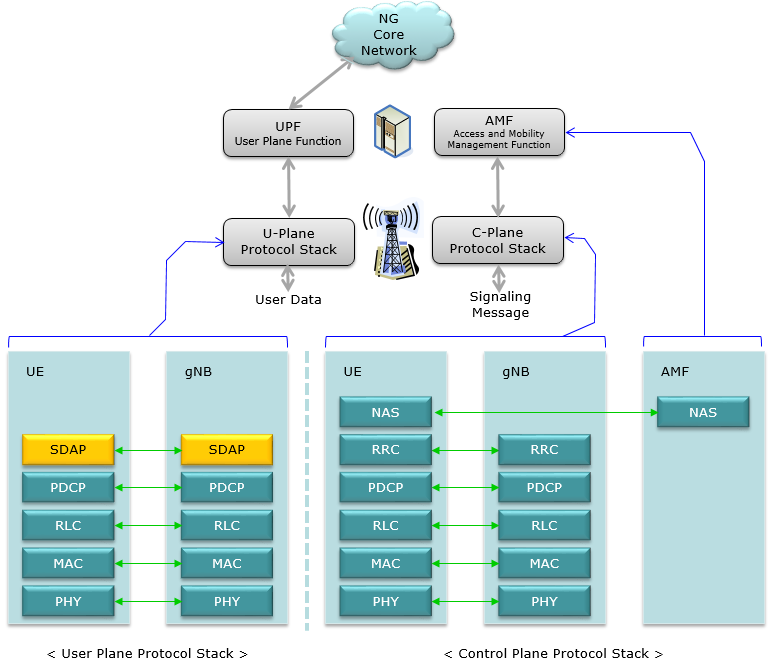
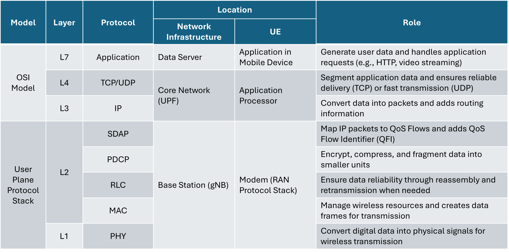
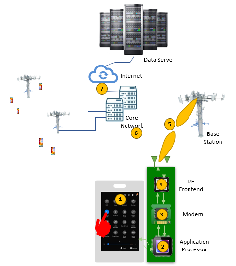

## 5G Architecture and Protocol Stack Overview

---

{: width="85%"}_[https://www.sharetechnote.com/html/5G/5G_RadioProtocolStackArchitecture.html](https://www.sharetechnote.com/html/5G/5G_RadioProtocolStackArchitecture.html)_

### User Plane Protocol Stack in 5G

- The 5G protocol stack introduces **SDAP (Service Data Adaptation Protocol)** as a new layer within the **User Plane**.
    - This layer is responsible for **mapping application data to QoS flows**, ensuring the quality of service (QoS) requirements for different applications.

## 5G Architecture and Protocol Stack Overview

---

### Application Data Flow in 5G User Plane Protocol Stack

### Message Flow (Uplink)

The following diagram illustrates the **Uplink Message Flow** in the 5G system:

{: width="90%"}_[https://www.sharetechnote.com/html/5G/5G_RadioProtocolStackArchitecture.html](https://www.sharetechnote.com/html/5G/5G_RadioProtocolStackArchitecture.html)_

1. **Application Layer**
    - The **data generation phase.**
    - When a user executes an application and requests data, the application layer generates data corresponding to that request .(e.g., HTTP requests or video files)
2. **Application Processor**
    - Ensures **data reliability and routing.**
    - Encapsulates application data into **TCP/UDP segments.**
    - Creates **IP packets** and delivers them to the modem.
3. **Modem**
    - The **SDAP layer maps IP packets** to the appropriate **QoS Flow.**
    - Processes data through the **PDCP → RLC → MAC → PHY layers** for physical transmission.
4. **RF Frontend**
    - Converts PHY-layer processed data into **wireless signals** for transmission through the RF frontend.
    - Sends the wireless signal to the **base station (gNB).**
5. **Base Station (gNB)**
    - Processes received data through the **PHY → MAC → RLC → PDCP → SDAP layers.**
    - Forwards the processed data to the **Core Network.**
6. **Core Network**
    - The **UPF (User Plane Function)** manages data flows
    - **TCP ensures reliability** by:
        - Verifying packet integrity via ACK responses.
        - Reassembling TCP segments into application data.
    - Routes IP packets to the **Data Server.**
7. **Internet → Data Server**
    - The final destination.
    - Processes the data at the server’s **Application Layer.**

## **Data Flow: Sender Perspective**

---

### 1. Application Layer

- **Data generation**: Handles incoming or outgoing data requests and creates the payload to be sent.

### 2. TCP Layer

- Divides the payload into **segments** that fit within the available **Send Window** and **Maximum Segment Size (MSS).**
- Adds a **TCP header** to each segment before forwarding it to the IP layer.

### 3. IP Layer

- **IP Fragmentation**: If the segment from the TCP layer exceeds the **MTU (Maximum Transmission Unit)**, the IP layer splits it into smaller fragments.
    - **Efficiency Concerns**: Fragmentation introduces additional IP headers for each fragment, increasing overhead.
    - If **any fragment is lost**, the entire segment must be retransmitted by the **TCP layer**, causing **performance degradation**.
- To avoid fragmentation, **Dynamic Path MTU Discovery** adjusts the **MSS (Maximum Segment Size)** dynamically based on the MTU of the network path.
- Each fragment is encapsulated with an **IP header** and passed to the SDAP layer for further processing.

### 4. SDAP (Service Data Adaptation Protocol) Layer

#### QoS Flow Mapping

- The SDAP layer maps application data to the appropriate **QoS Flow** based on its **QoS Flow Identifier (QFI)**.
    - Each QFI corresponds to a specific **QoS profile** that defines requirements like:
        - Latency.
        - Throughput.
        - Reliability.
- The mapping ensures that application data is transmitted according to its specific QoS requirements.

#### SDAP Header Addition

- The SDAP layer adds an **SDAP header** to the data, which includes the **QFI**.
    - **QFI** identifies the QoS flow for the data.
    - This ensures the correct QoS treatment as the data moves through the protocol stack.

#### DRB Mapping

- The SDAP layer maps each QoS flow to a specific **Data Radio Bearer (DRB)**.
    - A single DRB may serve multiple QoS flows, but this depends on the QoS profiles and network configuration.
    - DRB mapping ensures that data is carried through the correct logical channel in the RLC layer.

#### Data Forwarding
- Once the SDAP header is attached and QoS mapping is complete:
    - The SDAP layer delivers the **SDAP SDU** to the **PDCP Layer** for further processing (e.g., encryption, compression).

### 5. PDCP (Packet Data Convergence Protocol) Layer

#### Header Compression

- Compresses upper-layer headers (e.g., TCP, IP, SDAP) using **ROHC (Robust Header Compression)**.
- This minimizes the size of the headers, improving transmission efficiency and conserving bandwidth.

#### Data Encryption and Integrity Protection

- **Encryption**:
    - Encrypts the payload using standard algorithms such as **AES (Advanced Encryption Standard)** or **SNOW 3G**.
    - The encryption key is derived from security keys (e.g., **K_RRC** or **K_UP**) established during the **RRC security procedure**.
- **Integrity Protection**:
    - Generates a **HMAC (Hash-based Message Authentication Code)** to ensure the integrity of the entire PDCP PDU.
    - The HMAC guarantees that the data has not been altered during transmission.
    - Integrity keys are derived through the same key derivation process used for encryption.

#### PDCP Header Addition

- Adds the **PDCP header**, which contains critical information such as sequence numbers for reordering and retransmission.

#### PDCP PDU Structure
- The resulting **PDCP PDU (Protocol Data Unit)** comprises:
    - **PDCP Header**
    - **Compressed Upper-layer Headers (TCP/IP/SDAP)**
    - **Encrypted Payload**
    - **HMAC for Integrity Protection**

After processing, the PDCP PDU is delivered to the **RLC layer** for further segmentation and transmission.

### 6. RLC (Radio Link Control) Layer

#### Transmission Modes

- The RLC layer supports three modes tailored to different application requirements:
    - **Transparent Mode (TM)**:
        - No segmentation or retransmission.
        - Primarily used for broadcasting system messages.
    - **Unacknowledged Mode (UM)**:
        - Segments and transmits data without retransmission.
        - Suitable for low-latency applications like video streaming, VoIP, or online gaming.
    - **Acknowledged Mode (AM)**:
        - Ensures reliable transmission with **ACK/NACK-based retransmission**.
        - Segments data and retransmits lost packets based on **Poll Trigger mechanisms**.
        - Typically used for applications requiring high reliability, such as file transfers or VoLTE.

#### Segmentation and Concatenation

- **Segmentation**:
    - When the **PDCP SDU size** exceeds the TBS (Transport Block Size) requested by the MAC layer, the RLC layer splits the SDU into smaller **RLC PDUs**.
    - Sequence numbers (SNs) are assigned to each PDU for ordering.
- **Concatenation**:
    - If the **PDCP SDU size** is smaller than the requested TBS, the RLC layer concatenates multiple SDUs into a single **RLC PDU**.
    - This ensures efficient use of resources and reduces header overhead.

#### Acknowledgment Mechanism (AM Mode)

- **Poll Trigger**:
    - The sender periodically triggers acknowledgments by setting the **Poll Bit** in the RLC header.
    - Poll Trigger can occur based on:
        - The number of transmitted RLC PDUs.
        - The total size of transmitted data exceeding a predefined threshold.
    - Upon receiving a PDU with the Poll Bit set, the receiver generates a **Status PDU** containing ACK/NACK information for received or missing RLC PDUs.
- **Retransmission**:
    - If a **NACK** or no response is received within the **t-PollRetransmit timer**, the sender retransmits the corresponding RLC PDUs.
    - This mechanism ensures reliability without excessive overhead.

#### RLC Header

- Includes critical information:
    - **Sequence Number (SN)**: Identifies the order of PDUs.
    - **Segmentation Info**: Specifies the start and end of fragmented data.
    - **Polling Bit**: Triggers acknowledgment responses in AM mode.

#### Interaction with MAC Layer

- The RLC layer prepares PDUs based on the TBS provided by the MAC layer.
- Dynamically performs segmentation or concatenation to match the requested TBS.

#### Final Output

- The RLC layer sends **RLC PDUs** to the MAC layer, optimized for efficient transport while maintaining reliability and flow control in AM mode.

### 7. MAC (Medium Access Control) Layer

#### Resource Scheduling

- Manages **logical channel priorities** based on QoS requirements.
- Allocates resources to each logical channel based on:
    - Buffer status reports (BSR) from RLC.
    - QoS flow requirements (e.g., 5QI - 5G QoS Identifier).
    - Channel conditions reported by PHY (e.g., CQI - Channel Quality Indicator).

#### Interaction with PHY for TBS

- The MAC layer **requests resources** from the PHY layer based on data buffer status and QoS requirements.
- The PHY layer calculates the **Transport Block Size (TBS)** based on:
    - Allocated resource blocks (RBs).
    - Modulation and Coding Scheme (MCS).
    - Channel conditions.
- The PHY layer provides the calculated TBS back to the MAC layer.

#### Segmentation and Padding

- The MAC layer ensures data fits within the TBS provided by the PHY layer:
    - Segments RLC PDUs if the data size exceeds the TBS.
    - Adds padding if the data size is smaller than the TBS, ensuring efficient utilization of resources.
- **Triggered by Scheduling**:
    - These operations are a direct result of **scheduling decisions**, where the MAC layer determines how to distribute the available TBS among multiple RLC flows based on their priorities

#### MAC Header

- Adds a MAC header containing:
    - **Logical Channel ID (LCID)** to identify the source of the data.
    - Length fields indicating the size of each data segment.
    - Control information such as BSR or Power Headroom Report (PHR).

#### Final Interaction with PHY

- The MAC layer delivers the prepared **MAC PDU** (including header and payload) to the PHY layer for transmission.

### 8. PHY (Physical) Layer

#### Resource Allocation and Mapping

- Maps data onto physical resources in the **time domain (slots)** and **frequency domain (resource blocks, RBs)**.
- Uses **OFDM (Orthogonal Frequency Division Multiplexing)** to efficiently transmit data over multiple subcarriers.

#### Transport Block Size (TBS) Calculation

- The PHY layer calculates the TBS based on the following parameters:
    - **Modulation and Coding Scheme (MCS)**: Determines the number of bits per symbol.
    - **Number of Resource Blocks (RBs)**: Allocated by the MAC layer based on CQI (Channel Quality Indicator).
    - **Code Rate (R)**: Represents the ratio of information bits to total bits transmitted.
    - Formula:
        
        $$
        TBS = R \times M \times Q
        $$
        
        - $R$: Code rate (e.g., 1/3, 2/3).
        - $M$: Bits per modulation symbol (e.g., 2 for QPSK, 4 for 16QAM, 6 for 64QAM).
        - $Q$: Number of allocated RBs × OFDM symbols.
- Reports the calculated TBS to the MAC layer.

#### Modulation and Channel Coding

- **Modulation**: Converts digital data (bits) into analog symbols using modulation schemes like QPSK, 16QAM, or 64QAM.
- **Channel Coding**: Applies **FEC (Forward Error Correction)** to improve transmission reliability.
    - Uses advanced coding techniques like **LDPC (Low-Density Parity Check)** for eMBB and **Polar Codes** for URLLC.

#### Beamforming and MIMO

- **Beamforming**: Focuses the signal in a specific direction for enhanced signal strength and reduced interference.
- **MIMO (Multiple-Input Multiple-Output)**: Increases spectral efficiency by transmitting multiple data streams simultaneously.

#### Interaction with MAC

- Receives TBS and resource allocation requests from the MAC layer.
- Provides feedback on channel conditions via CQI reports to optimize resource allocation and modulation.

#### Transmission
- Converts the transport block into radio signals and transmits them via antennas.

## **Data Flow: Receiver Perspective**

---

### 1. PHY Layer

#### Signal Reception

- Captures OFDM signals transmitted through antennas.

#### OFDM Signal Restoration

- **Resource Block (RB) demapping**: Maps OFDM symbols back to their respective time and frequency resources.
- **Fast Fourier Transform (FFT)**: Converts analog OFDM signals into digital symbols for further processing.

#### Demodulation and Decoding

- **Demodulation**: Converts symbols to bits using the modulation scheme (e.g., QPSK, 16QAM).
- **Channel Decoding**: Applies error correction coding (e.g., LDPC or Turbo coding) to restore the original data.

#### HARQ Processing

- Checks for errors and sends either **ACK** (acknowledgment) or **NACK** (negative acknowledgment) to the sender.
- Performs **soft combining**, leveraging previous transmissions to improve decoding success.

Passes the decoded **Transport Block (TB)** to the MAC layer.

### 2. MAC Layer

- **MAC PDU Decoding**:
    - Analyzes the MAC header to identify:
        - **Logical Channel ID (LCID)** for flow identification.
        - **Length** for the size of each logical channel data.
    - Extracts **control information** (e.g., Buffer Status Reports, Power Headroom Reports).
- **Padding Removal**: Eliminates padding from unused TBS space.
- Distributes logical channel data to respective **RLC entities**.

### 3. RLC Layer

#### RLC PDU Reception and Processing

- **Receiving RLC PDUs from MAC Layer**:
    - The RLC layer receives data from the MAC layer.
    - The received data can be:
        1. **A complete RLC PDU**: If the PDU is received fully, it is processed immediately.
        2. **A partial RLC PDU**: If the PDU is fragmented, the RLC layer waits for the remaining fragments to complete it.

#### Reassembly Mechanism

- **Fragment Processing**:
    - The RLC layer checks if the received PDU contains **Segmentation Information**:
        - **Complete PDU**: Directly forwarded to the upper layer (PDCP).
        - **Fragmented PDU**: Uses segmentation flags (start/end flags) to determine how to reassemble the fragments.
- **T-Reassembly Timer Activation**:
    - When only part of a PDU or sequence is received, the **T-Reassembly Timer** is triggered.
    - Timer behavior:
        1. **During Timer Activation**:
            - If the remaining fragments or PDUs are received before the timer expires, the RLC layer reassembles the complete SDU and forwards it to the PDCP layer.
        2. **When the Timer Expires**:
            - If the reassembly is incomplete, the RLC layer either:
                - **Discards the incomplete data**, or
                - Forwards it to the upper layer (PDCP), depending on the implementation or transmission mode.

#### Sequence Management and Alignment

- **Sequence Number-Based Ordering**:
    - Each RLC PDU includes a **Sequence Number (SN)**.
    - The RLC layer uses these SNs to ensure the correct order of data before forwarding it to the PDCP layer.
    - If out-of-order PDUs are detected:
        - Missing SNs are identified, and the **T-Reassembly Timer** is activated to wait for the missing data.
        - Once the sequence is complete or the timer expires, the RLC layer processes the data accordingly.

#### Behavior Based on Transmission Mode

- **Transparent Mode (TM)**:
    - No sequence management or reassembly is performed.
    - Data is forwarded to the upper layer as-is, typically used for broadcast messages (e.g., system information).
- **Unacknowledged Mode (UM)**:
    - Data is transmitted without retransmissions.
    - Missing PDUs are discarded, and only received data is forwarded to the PDCP layer.
- **Acknowledged Mode (AM)**:
    - Ensures reliable delivery through retransmissions.
    - The receiver responds to polling from the sender by sending a **Status PDU** containing ACK/NACK information.
    - If missing PDUs are detected, the receiver requests retransmission.

#### Final Data Handling

- **RLC SDU Delivery**:
    - The RLC layer forwards complete SDUs to the upper layer (PDCP), ensuring data integrity.
    - In cases of incomplete data (e.g., timer expiration), the RLC layer processes it according to the transmission mode and implementation.
- **PDU Sequence Restoration**:
    - In **AM and UM modes**, reorders data using **Sequence Numbers (SN)**.
    - Waits for missing data using a **T-Reassembly timer**.
- **Segmentation and Reassembly**:
    - **Reassembly**: Combines fragmented RLC PDUs into the original PDCP SDUs.
    - **Segmentation**: Splits large PDCP SDUs if needed.
- Passes the reassembled **PDCP SDUs** to the PDCP layer.

### 4. PDCP Layer

#### Sequence Reordering

- The PDCP layer restores the correct order of data using **Sequence Numbers (SNs)** received from the RLC layer.
- Data from the RLC layer may arrive out of order; the PDCP layer reorders this data into a single, correctly ordered **sequence**.
- Once reordering is complete, the sequence forms a single **PDCP PDU**, which is processed further.

#### Header Decompression

- The PDCP layer uses **ROHC (Robust Header Compression)** to reconstruct the original **TCP/IP headers** from the compressed headers received.

#### Decryption and Integrity Verification

- **Decryption**:
    - The PDCP layer decrypts the data payload to restore its original state.
    - Decryption uses keys derived during the security procedure (e.g., K_UP).
- **Integrity Verification**:
    - Validates the data's integrity using **Message Authentication Code for Integrity (MAC-I)**.
    - If the integrity check fails, the data is discarded.

#### Delivery to SDAP Layer

- The PDCP layer delivers the fully restored PDCP PDU to the **SDAP layer** for QoS flow processing.

### 5. SDAP Layer

#### QoS Flow Identification

- The SDAP layer extracts the **QoS Flow Identifier (QFI)** from the received PDCP PDU header.
- Each QFI is mapped to a specific **Data Radio Bearer (DRB)**, which is associated with a QoS flow.

#### Mapping Data to QoS Flows

- The SDAP layer identifies which QoS flow the data belongs to using the extracted QFI.
- It classifies and groups incoming PDCP PDUs that belong to the same QoS flow.

#### Reordering Across DRBs

- If multiple DRBs are active, the SDAP layer ensures the correct order of data within each DRB.
- Data from different DRBs is processed independently based on their respective QoS requirements.

#### Handling QoS Policies

- The SDAP layer applies QoS policies (e.g., latency, throughput, reliability) to manage traffic prioritization and scheduling for each DRB.

#### Delivery to IP Layer

- Once the data is classified and processed, the SDAP layer forwards the **SDAP SDUs** to the **IP layer** for further protocol stack processing.

### 6. IP Layer

- **IP Header Restoration**: Reconstructs the IP header.
- **Fragment Reassembly**: Combines fragmented packets into complete IP packets.
- **Protocol Identification**: Identifies whether the data belongs to **TCP** or **UDP**.
- Forwards the packet to the TCP layer.

### 7. TCP Layer

- **Segment Sequence Restoration**:
    - Reorders TCP segments using **Sequence Numbers**.
- **Integrity Check**: Verifies segment integrity using **checksum**.
- **ACK Transmission**:
    - Sends an ACK to the sender for successfully received data.
- **Segment Reassembly**: Combines TCP segments into the original data stream.
- Passes the complete data stream to the **Application Layer**.

### 8. Application Layer

- Processes the received data and generates appropriate responses.

## Retransmission Mechanisms Across Layers

---

### 1. PHY/MAC Layers

- **Retransmission Unit**: **Transport Block (TB)**.
- **Retransmission Protocol**: **HARQ (Hybrid Automatic Repeat Request)**.
    - The PHY layer handles retransmissions of TBs based on ACK/NACK responses from the receiver.
    - **Soft Combining**: Combines previously received TB data with newly received retransmissions to improve decoding success.
    - HARQ operates with **low latency** (few milliseconds) to ensure rapid retransmission and recovery.

#### Sender Perspective

- **HARQ Process Management**:
    - The sender retains each TB in the HARQ buffer until it receives an ACK or NACK from the receiver.
    - If a NACK is received, the sender retransmits the TB.
- **Soft Combining Support**:
    - Retransmitted data is encoded to allow the receiver to combine it with previously received data fragments, improving the decoding success rate.

#### Receiver Perspective

- **ACK/NACK Generation**:
    - After decoding a TB, the receiver sends an ACK (if successful) or a NACK (if errors are detected) to the sender.
- **Soft Combining at Receiver**:
    - The receiver combines retransmitted data with previous TB fragments to maximize decoding performance.

### 2. RLC Layer

- **Retransmission Unit**: **RLC PDU**.
- **Retransmission Protocol**: **ACK/NACK-based Polling Mechanism (AM Mode)**.
    - The RLC layer periodically triggers **Poll Requests** to check the status of transmitted PDUs
    - The receiver sends the **Status PDU**, which includes ACK/NACK information for each RLC PDU.

#### Sender Perspective

- **Polling Mechanism**:
    - The sender periodically triggers a **Poll PDU** by setting the Poll Bit in the RLC header to request a **Status PDU** from the receiver.
- **t-PollRetransmit Timer**:
    - If no response is received within the timer, the sender retransmits the PDUs identified as missing.
- **Retransmission Management**:
    - The sender retransmits PDUs marked as NACK in the received Status PDU.

#### Receiver Perspective

- **Status PDU Generation**:
    - The receiver maintains a bitmap of received RLC PDUs and responds to Poll PDUs by sending a **Status PDU** containing ACK/NACK information.

### 3. PDCP Layer

- **Retransmission Unit**: **PDCP PDU**.
- **Retransmission Protocol**: **STATUS REPORT-based Mechanism (Optional)**.
    - The receiver uses **Sequence Numbers (SNs)** to track missing PDCP PDUs.
    - If a missing PDU is detected, the receiver generates a **STATUS REPORT** requesting retransmission.
    - The sender retransmits the requested PDCP PDUs based on the STATUS REPORT.
    - PDCP retransmission is generally used in conjunction with **Unacknowledged Mode (UM)** at the RLC layer to enhance reliability.

#### Sender Perspective

- **Sequence Number Management**:
    - The sender tracks all transmitted PDCP PDUs using sequence numbers.
- **Retransmission Trigger**:
    - If a STATUS REPORT is received from the receiver indicating missing PDUs, the sender retransmits them.

#### Receiver Perspective

- **STATUS REPORT Generation**:
    - The receiver generates a STATUS REPORT based on missing PDUs identified through sequence numbers.
- **Reordering**:
    - The receiver reorders out-of-sequence PDUs to ensure data consistency before forwarding them to the upper layers.

### 4. TCP Layer

- **Retransmission Unit**: **TCP Segment**.
- **Retransmission Protocol**: **ACK-based Mechanism**.
    - TCP ensures reliability using an acknowledgment system:
        - **ACK**: Sent by the receiver to confirm successful delivery of data.
        - **Timeout-based Retransmission**: If an ACK is not received within the **Retransmission Timeout (RTO)**, the sender retransmits the segment.
        - **Duplicate ACKs**: When the receiver sends multiple ACKs for the same data (e.g., due to packet loss), the sender performs **Fast Retransmission**.
    - TCP retransmission operates end-to-end, independently of lower-layer retransmission mechanisms.

#### Sender Perspective

- **Retransmission Trigger**:
    - Retransmission occurs if:
        - An ACK is not received within the **Retransmission Timeout (RTO)**.
        - Duplicate ACKs indicate packet loss.
- **Fast Retransmission**:
    - The sender retransmits a segment without waiting for the RTO if multiple duplicate ACKs are received.

#### Receiver Perspective

- **ACK Generation**:
    - The receiver sends an ACK for successfully received segments.
- **Duplicate ACKs**:
    - If out-of-order segments are received, the receiver sends duplicate ACKs to signal missing data.
- **Out-of-Order Handling**:
    - The receiver buffers out-of-order segments while waiting for missing ones to complete the sequence

## Potential Overlaps Between Layers

---

### PHY/MAC vs. RLC

- **Retransmission Overlap Possibility**: None
- **Reason**:
    - PHY/MAC layers handle retransmissions immediately (via HARQ), completing the process before RLC's periodic retransmissions are triggered by Polling PDUs.
    - Even in scenarios involving Polling PDUs, the process flow ensures no overlap occurs.

#### Polling PDU Scenario

- An RLC Polling PDU is segmented into two MAC PDUs.
- One MAC PDU is successfully delivered, while the other fails.
- The first MAC PDU is processed by RLC, but the second is retransmitted via HARQ.

#### Why Overlap Does Not Occur

1. The second MAC PDU, containing part of the RLC Polling PDU, fails and triggers a NACK at the PHY layer.
2. HARQ retransmits the failed MAC PDU before RLC's **t-PollRetransmit timer** expires.
3. RLC processes a complete RLC PDU only after all associated MAC PDUs are successfully received.
4. RLC generates a Status PDU in response to a Polling PDU **only after** the Polling PDU has been fully received at the PHY/MAC layer.

### RLC vs. PDCP

- **Retransmission Overlap Possibility**: There may be overlapping retransmission requests, but actual retransmissions are not duplicated.
- **Reason**: The layered structure and prioritization ensure that only one layer handles the retransmission at a time.
- **Overlapping Retransmission Requests Cases**:
    1. PDCP sends a STATUS REPORT first, followed by RLC Poll PDU.
    2. RLC sends a STATUS PDU first, but incomplete sequences trigger a PDCP STATUS REPORT later.

#### Case 1: PDCP STATUS REPORT First

- **Scenario**:
    - PDCP detects missing PDUs and sends a STATUS REPORT to the sender.
    - Subsequently, RLC Poll PDU triggers a Status PDU requesting retransmission for the same data.
- **Handling**:
    - The sender prioritizes the PDCP's retransmission request, as it is processed at a higher layer.
    - RLC's retransmission request for the same data is ignored

#### Case 2: RLC STATUS PDU First

- **Scenario**:
    - RLC sends a STATUS PDU after detecting missing PDUs via Poll PDU.
    - Meanwhile, incomplete sequences are passed to the PDCP layer due to **T-Reassembly Timer** expiration.
    - The PDCP layer identifies the same missing PDUs and sends a STATUS REPORT.
- **Handling**:
    - The sender prioritizes retransmissions triggered by RLC, as they occur at a lower layer.
    - PDCP STATUS REPORT requests for overlapping data are ignored.

### PDCP vs. TCP

- **Retransmission Overlap Possibility**: Exists due to the **separate and independent mechanisms** of TCP and PDCP.
- **Reason**:
    - PDCP operates at the wireless link, where the **receiver** triggers retransmissions based on missing PDUs.
    - TCP operates end-to-end, where the **sender** triggers retransmissions based on ACK timeouts or duplicate ACKs.
    - Neither layer coordinates its retransmission logic, making overlap more likely.

#### Detailed Explanation

1. **How Each Layer Handles Retransmissions**:
    - **PDCP**:
        - Ensures reliability in the wireless environment by allowing the receiver to request retransmissions via **STATUS REPORTs**.
        - Decisions are localized to the wireless segment of the network and focus on compensating for radio link errors.
    - **TCP**:
        - Provides end-to-end reliability by retransmitting segments based on:
            1. **Retransmission Timeout (RTO)** if ACKs are delayed or missing.
            2. **Fast Retransmission** upon receiving multiple duplicate ACKs.
2. **Independent Judgment**:
    - **PDCP Receiver**:
        - Detects missing PDUs and requests retransmissions.
    - **TCP Sender**:
        - Observes end-to-end conditions and retransmits based on segment-level acknowledgment failures.
3. **Why Overlap Risk is High**:
    - **Receiver-Side (PDCP) vs. Sender-Side (TCP)**:
        - PDCP retransmissions are decided by the receiver (localized to the wireless link).
        - TCP retransmissions are decided by the sender (based on global, end-to-end feedback).
        - These independent layers cannot coordinate or cancel duplicate retransmission requests.

#### Issues with Overlap

1. **Resource Wastage**:
    - Both layers retransmit the same data redundantly, consuming unnecessary network and processing resources.
2. **Increased Latency**:
    - Redundant retransmissions delay overall delivery of data to the application.

#### Solutions

1. **Disable PDCP Retransmissions for TCP Traffic**:
    - For TCP-based services (e.g., eMBB), rely solely on TCP retransmissions.
2. **Enable PDCP Retransmissions for UDP Traffic**:
    - For latency-sensitive applications (e.g., VoIP), enable PDCP retransmissions to compensate for UDP's lack of reliability.
3. **Timer Adjustment (Hybrid)**:
    - For services like URLLC, configure PDCP timers (e.g., **T-Status-Prohibit**) to expire faster than TCP timeouts, ensuring efficient retransmissions without overlap.

## References

---

1. **3GPP TS 38.322: Radio Link Control (RLC) Protocol Specification, 3GPP Release 17, 3rd Generation Partnership Project (3GPP)**. Available at: https://www.3gpp.org/ftp/Specs/archive/38_series/38.322/
    - **Key Sections Referenced**:
        - Section 5.3: **Data Transfer Services and Functions** (segmentation and reassembly).
        - Section 6.1: **Protocol Data Units (PDUs)** (ACK/NACK handling, Polling mechanism).
        - Section 6.1.3: **Timers** (t-PollRetransmit and reassembly logic).
2. **3GPP TS 38.323: Packet Data Convergence Protocol (PDCP) Specification, 3GPP Release 17, 3rd Generation Partnership Project (3GPP)**. Available at: https://www.3gpp.org/ftp/Specs/archive/38_series/38.323/
    - **Key Sections Referenced**:
        - Section 5.2: **Sequence Number Management** (STATUS REPORT-based retransmissions).
        - Section 6.2: **PDCP PDU Formats** (handling retransmissions and STATUS REPORTs).
        - Section 6.3: **Timers** (e.g., T-Status-Prohibit).
3. **3GPP TS 38.331: Radio Resource Control (RRC) Protocol Specification, 3GPP Release 17, 3rd Generation Partnership Project (3GPP)**. Available at: https://www.3gpp.org/ftp/Specs/archive/38_series/38.331/
    - **Key Sections Referenced**:
        - Section 5.3.3: **RRC Procedures for Configuration** (retransmission-related parameter settings).
        - Section 6.3: **RRC Messages** (interaction between RRC and retransmission mechanisms).
4. **3GPP TS 36.300: Evolved Universal Terrestrial Radio Access (E-UTRA) and Evolved Universal Terrestrial Radio Access Network (E-UTRAN); Overall Description, 3GPP Release 15, 3rd Generation Partnership Project (3GPP)**. Available at: https://www.3gpp.org/ftp/Specs/archive/36_series/36.300/
    - **Key Sections Referenced**:
        - Section 6.5: **HARQ Operations in LTE** (conceptual references for HARQ in NR).
        - Section 10.1: **Retransmission Mechanisms in LTE** (framework carried forward to 5G NR).
5. **RFC 793: Transmission Control Protocol (TCP) Specification, Internet Engineering Task Force (IETF), September 1981**. Available at: https://www.rfc-editor.org/rfc/rfc793
    - **Key Sections Referenced**:
        - Section 3.2: **Retransmission Timeout (RTO)** and acknowledgment mechanisms.
        - Section 3.7: **Sliding Window and Data Sequencing** (basis for TCP retransmissions).
6. **RFC 1191: Path MTU Discovery, Internet Engineering Task Force (IETF), November 1990**. Available at: https://www.rfc-editor.org/rfc/rfc1191
    - **Key Sections Referenced**:
        - Section 4: **Fragmentation Avoidance with MTU Discovery** (dynamic MSS adjustment).
        - Section 6: **PMTUD Mechanism Details** (protocol-level adaptation).
7. **RFC 4821: Packetization Layer Path MTU Discovery, Internet Engineering Task Force (IETF), March 2007**. Available at: https://www.rfc-editor.org/rfc/rfc4821
    - **Key Sections Referenced**:
        - Section 3: **Dynamic Path MTU Updates** (integrated PMTUD for modern networks).
        - Section 5: **Interaction with TCP and UDP** (layer-specific PMTUD strategies).