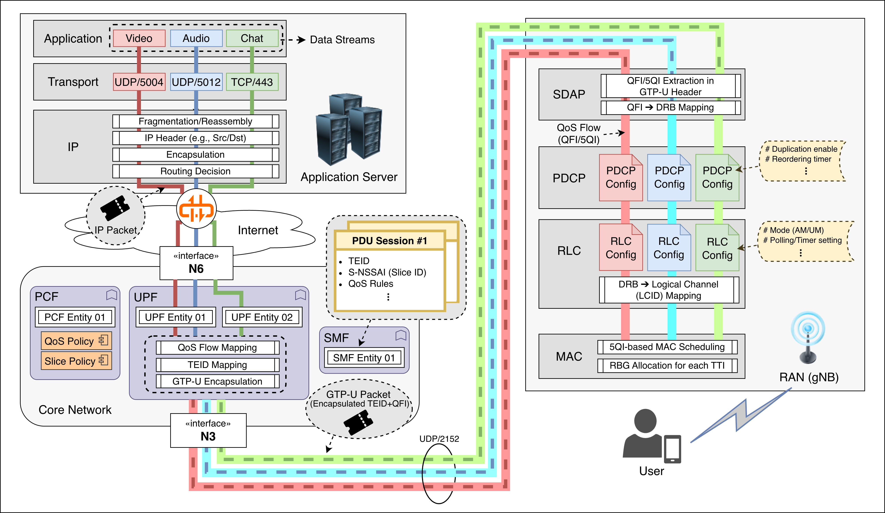

***Where does End-to-End QoS actually materialize?*** 

Beyond abstract 5QI definitions and policy rules in the Core, QoS becomes real only when data flows through the entire network stack — from Application servers through the Core and down to RAN schedulers, where packets are finally transmitted over the air. 

This post walks through each stage to reveal how 5G turns high-level QoS rules into concrete packet behavior across the network.


## 📌 Overall Downlink Path Summary

---

{: width-"90%"}_Multi-flow E2E Data Transmission in 5G Downlink. Three application flows (Video, Audio, Chat) traverse the network stack independently, each mapped to distinct QoS Flows (QFI) at the UPF, then to separate DRBs at the RAN, where MAC scheduling finally allocates radio resources according to 5QI-based priorities._

| Step | Network Domain | Transmission Unit | Control Mechanism |
| --- | --- | --- | --- |
| ① Application Server | App domain | App data | TCP/UDP |
| ② Internet Backbone | Public / MNO AS | IP packet | hop-by-hop routing |
| ③ UPF ingress (Core entry) | Core domain | IP packet | PDR/FAR/QER matching |
| ④ UPF egress | Core → RAN | GTP-U encapsulated packet | HTB / DRR / WFQ scheduling |
| ⑤ RAN (gNB) | Access domain | MAC/RLC PDU | PF / RR / RL-based |
| ⑥ UE | Device domain | App data | TCP/UDP delivery |


## 1️⃣ Application Traffic Generation

---

A single application server generates and delivers multiple types of traffic for service delivery.

For example, in a video conferencing application such as Zoom or Google Meet:

| Function | Transport Type | Protocol / Port Example | QoS Characteristics |
| --- | --- | --- | --- |
| Video stream | UDP RTP | port 5004 | high throughput, low delay |
| Audio stream | UDP RTP | port 5006 | low delay, small packet |
| Chat message | TCP | port 443 (WebSocket) | best effort |
| Screen sharing | UDP/TCP | ports 3478–3480 (STUN/TURN) | moderate bitrate |
| Control signaling | TCP | port 443 | infrequent |

Depending on transport type and QoS characteristics, multiple traffic types are sent, and each of them forms one **Transport Flow ➔ IP Flow**.

- The application server (e.g., YouTube, Zoom, Cloud, etc.) sends data (HTTP, RTP, etc.) to the **Transport Layer (TCP/UDP)**, and the OS network stack encapsulates it into an **IP packet**
    
    ```
    [IP header (dst = UE IP)] [TCP/UDP header] [Payload]
    ```
    
- In the Core, traffic is classified by **Transport Flow (5-tuple)**
    
    ```
    (src IP, dst IP, src port, dst port, protocol)
    ```
    
- Even within a single application, if multiple ports, protocols, or sub-channels are used, the Core network treats them as multiple IP flows.

### Congestion Control in Transport Layer

Transport Congestion Control (CC) determines how fast the application injects data into the network. The sending rate and pacing behavior directly influence latency, jitter, and loss observed along the path.

#### ⚙️ Common Algorithms

- **CUBIC**: Loss-based CC, widely deployed (Linux default). Aggressively increases sending rate until packet loss occurs.
- **BBR (Bottleneck Bandwidth and RTT)**: Model-based CC developed by Google. Estimates available bandwidth and minimum RTT to avoid excessive queuing.
- **NewReno**: Classic loss-based approach, conservative but stable.


## 2️⃣ Internet Routing

---

- The generated IP packets travel **hop-by-hop** through the public Internet.
- They pass through **multiple routers, IXs (Internet Exchanges), and transit providers** before reaching the **MNO’s Core Network entry (UPF N6)** corresponding to the UE.

### Global Routing Table (MNO Backbone)

- Each MNO operates its own **backbone (AS, Autonomous System)**, meaning that the internal Internet routing structure differs by operator:
    - Vodafone → AS3209
    - Deutsche Telekom → AS3320
    - Telefónica O2 → AS6805
- Each packet follows the routing table within the MNO’s Internet backbone, which directs packets to the UPF belonging to the UE’s network:
    - The UPF advertises its reachable IP prefixes via **BGP** (“send traffic for this IP to me”).
    - Routers within the MNO core register the UPF’s N6 interface IP as the next hop in their routing tables.
    - External Internet packets are then forwarded hop-by-hop until they reach the UPF’s N6 IP address.
        


## 3️⃣ UPF Forwarding in Core Networks

---

Once IP flows reach the UPF, packets go through the following steps before being forwarded to the target gNB:

1. The UPF **identifies the PDU Session** based on the packet’s UE IP address.
2. According to the **PDR (Packet Detection Rule)** configured by the SMF, the UPF determines which **QoS Flow (QFI)** the packet belongs to.
    - The QFI is derived from QoS parameters such as 5QI, GBR, and ARP.
3. The UPF encapsulates the packet with a **GTP-U header** containing the **QFI** and **TEID (Tunnel Endpoint ID)** (as defined in *3GPP TS 29.281 §5.3*)
4. The UPF forwards the GTP-U encapsulated packet to the RAN (target gNB) via the N3 interface.

### UPF Routing Table

| Type | Owner | Main Function | Example |
| --- | --- | --- | --- |
| **① Global Routing Table (MNO Backbone)** | MNO Core Router / Aggregation Router | Determines which UPF to forward incoming Internet packets to | “10.10.0.0/16 → UPF_MUC_01” |
| **② Local Routing Table (UPF Entity)** | Inside UPF server / VM / container | Forwards packets either to RAN (gNB) or external network (N6) | “RAN subnet → dev n3”, “0.0.0.0/0 → dev n6” |

### UPF Functional Pipeline

| Stage | Processing Task | Responsible Entity |
| --- | --- | --- |
| **Ingress (N6)** | Match incoming IP packets with PDR / FAR rules | UPF Core |
| **Routing lookup** | Determine which RAN tunnel (N3) corresponds to the UE IP | UPF local route table |
| **QoS handling** | Apply HTB / DRR scheduling per QFI | UPF scheduler |
| **Encapsulation** | Add GTP-U header (TEID, RAN endpoint) | UPF |
| **Egress (N3)** | Forward packet to gNB | UPF via local routing interface |


## *️⃣ IP Flow ⇔ QoS Flow Mapping

---

The mapping between an IP flow and its corresponding QoS Flow (QFI) is pre-defined by SMF policies. The UPF then determines which QFI each incoming IP packet belongs to.

### 5G QoS Hierarchy

| Level | Entity | Unit | Description |
| --- | --- | --- | --- |
| **QoS Policy Level** | PCF (Policy Control Function) | 5QI | Defines service class (delay, reliability, etc.) |
| **Session / Flow Management** | SMF (Session Management Function) | QFI | Determines which flow belongs to which QoS Flow (QFI) |
| **Bearer Mapping / Enforcement** | UPF + RAN (SDAP, scheduler) | QFI → DRB | Executes traffic handling (queueing, transmission) |

### PCF — “QoS Class Designer”

📘 **PCF = Policy engine that defines and provides QoS policies**

- Owns the global QoS policy database of the network
- Interprets QoS rules dynamically based on subscriber info (UDR/UDM) and slice info (S-NSSAI)
- Defines the QoS parameter set (QoS Characteristics) for each 5QI
(e.g., 5QI=1 → URLLC, 5QI=8 → Video Streaming)

➡️ Serves as a context-aware policy engine, not a static table

### SMF — “Flow-to-QoS Flow Mapper”

📘 **SMF = The manager that constructs actual QoS mappings**

- When creating a PDU Session, SMF receives QoS policies (5QI, etc.) from the PCF
- Maps each IP Flow to a QFI based on packet filters (5-tuple, application type, etc.)
- Generates and assigns QFI IDs and associates them with their corresponding 5QIs
- Distributes mapping info to both:
    - **RAN (Control Plane)** via RRC signaling (DRB + QFI/5QI mapping)
    - **UPF (User Plane)** via PDR/FAR/QER configuration for packet classification and QoS enforcement

Example👇

| Flow | 5QI | QFI | Description |
| --- | --- | --- | --- |
| UDP:5004 (video) | 8 | 5 | Streaming QoS Flow |
| TCP:443 (web) | 9 | 6 | Best-effort QoS Flow |
| UDP:5012 (voice) | 7 | 7 | Conversational QoS Flow |

➡️ The SMF acts as a central distributor, deploying QoS policies at the session level.

### UPF — “QoS Flow Enforcer”

📘 **UPF = The executor that applies QoS in the data plane**

- Classifies and handles packets based on PDR (Packet Detection Rule), FAR (Forwarding Action Rule), and QER (QoS Enforcement Rule) received from the SMF:
    - **PDR**: Identifies which QFI (QoS Flow) a packet belongs to
    - **FAR**: Defines forwarding, dropping, or duplication actions
    - **QER**: Applies rate limits, burst size, and marking policies
- Encapsulates packets with GTP-U headers including QFI, then forwards them to the RAN (gNB)

➡️ The UPF functions as a QoS enforcement engine, performing queueing, rate control, and forwarding per QoS Flow.

### gNB SDAP Layer

📘 **SDAP = The orchestrator that binds QoS Flows to radio bearers**

- The SDAP layer in gNB (and UE) **interprets the QFI** from the GTP-U header
and maps it to the corresponding **DRB (Data Radio Bearer)**
- Each DRB forms a **logical bearer stack (PDCP–RLC–MAC)** for transmission

**SDAP responsibilities:**  
1️⃣ Map QoS Flows (QFIs) to DRBs  
2️⃣ Propagate QoS properties (delay, reliability, priority) to lower layers

**QoS reflection by layer:**
- **PDCP:** duplication, reordering, header compression
- **RLC:** AM/UM mode, buffer size, discard timer
- **MAC:** scheduling weight, MCS/HARQ adaptation

➡️ SDAP serves as a control gateway linking QoS Flows to the full radio bearer stack (PDCP–RLC–MAC) for real QoS execution.


## *️⃣ PDU Session

---

A PDU Session is a logical IP session established between the UE and the Core Network. Each session represents a GTP-U tunnel (UE ↔ UPF) defined by the following configuration set.

### PDU Session Configuration

- **TEID (Tunnel Endpoint ID)** : Unique identifier for a GTP-U tunnel; used by the UPF and gNB to identify the session and demultiplex packets to the correct QoS Flow.
- **S-NSSAI (Slice ID)** : Identifies the network slice to which the session belongs.
- **DNN (Data Network Name)** : Target data network (e.g., Internet, MEC, or private).
- **UE IP Address** : IP assigned to the UE; serves as the destination IP in downlink packets.
- **Core Network** : The core domain of the connected MNO (e.g., specific 5GC domain).
- **PDU Type** : IPv4 / IPv6 / Ethernet.
- **UPF 경로** : The UPF chain traversed by the session (e.g., Edge → Central UPF); each GTP-U tunnel is uniquely identified by its TEID.
- **QoS Rules** : QoS Flow mappings (QFI/5QI) assigned by the SMF according to PCF policies.

➡️ All QoS Flows following this configuration belong to and are managed under the same PDU Session.

### UE ↔ Core Relationship

- Each PDU Session is uniquely bound to one UE and one Core Network.
- A single UE can maintain multiple PDU Sessions with the same core network, each with its own configuration set.
    - QoS policies, UPF paths, IP addresses, and PDU types

### Slice-based PDU Session Isolation

| Perspective | Effect |
| --- | --- |
| **QoS Separation** | URLLC and eMBB can meet delay•throughput requirements independently |
| **Security Isolation** | Industrial / public network traffic separated from consumer traffic |
| **Resource Reservation** | Dedicated resources per slice (scheduler, queue, buffer separation) |
| **Fault Isolation** | Failure in one session does not affect sessions in other slices |
| **Operational Efficiency** | Independent policy, charging, and SLA management per slice |

### PDU Session Establishment Process

#### 1️⃣ UE Attach (Registration)

1. **UE → AMF** : PDU Session request
2. **AMF → SMF** : Session creation request
3. **SMF**: Creates the default PDU Session

#### 2️⃣ When an Application Starts

1. The app opens a TCP/UDP socket, generating a new IP flow
2. UE’s IP stack creates a new socket (e.g., TCP 443)
3. Traffic is sent via the default session’s IP address (e.g., 10.10.0.12)
4. UPF matches the packet to a PDR (Packet Detection Rule) based on its 5-tuple
5. SMF policy decides whether to assign a new QFI within the same PDU Session or reuse an existing one
6. If needed, the SMF requests a new QoS class (5QI) from the PCF

#### 📋 A new PDU Session is created when

1. The destination network differs (e.g., IMS, corporate VPN) ➔ specific DNN access needed
2. A special network slice is required
3. A premium or isolated service (e.g., high-quality streaming) demands QoS separation beyond a single QoS Flow


## *️⃣ Multi-PDU Session Operation

---

When the UPF forwards an IP flow to the gNB using its TEID mapping, the gNB distinguishes which PDU Session the flow belongs to and applies the corresponding session configuration.

### UPF Packet Processing

The UPF maintains a session table received from the SMF, which stores the following mappings:

| Key | Mapping | Description |
| --- | --- | --- |
| **(TEID, N3 interface)** | → **PDU Session ID** | Identifies a GTP-U tunnel |
| **(PDU Session ID, QFI)** | → **QoS Flow** | Identifies QoS Flow within a session |
| **(QoS Flow, PDR filter)** | → **IP Flow (5-tuple)** | Matches the actual application flow |

The UPF also receives a preconfigured set of **PDR / FAR / QER** rules from the SMF:

| Rule Type | Key | Value | Function |
| --- | --- | --- | --- |
| **PDR** | Packet filter (5-tuple) | QFI | Determines “which QoS Flow this packet belongs to” |
| **FAR** | QFI | Forwarding Action (includes TEID) | Specifies “which tunnel to forward this flow through” |
| **QER** | QFI | Rate / marking policy | Applies “QoS limits such as rate or marking” |

#### UPF packet handling sequence 👇

The UPF handles each packet following the sequence as below:

1. PDR identifies the packet ➔ “This belongs to QoS Flow #7 (QFI=7)”
2. FAR determines ➔ “QFI=7 should be sent via TEID=0xA12F (Session 001)”
3. QER applies rate limiting or marking
4. UPF encapsulates the packet with GTP-U (QFI + TEID) and forwards it to the RAN

### Example: Two PDU Sessions on a Single UE

| PDU Session | S-NSSAI | DNN | UE IP | TEID | UPF Path | Typical Traffic |
| --- | --- | --- | --- | --- | --- | --- |
| #1 | eMBB | `internet` | 10.10.0.12 | 0xA12F | UPF-A | Web / Video |
| #2 | URLLC | `mec.app.local` | 10.20.0.45 | 0xB38E | UPF-B (Edge) | Real-time control |

#### UPF packet handling example 👇

1. If a packet arrives with GTP-U(TEID=0xA12F) ➔ belongs to PDU Session #1
2. If a packet arrives with GTP-U(TEID=0xB38E) ➔ belongs to PDU Session #2
3. Within each session, packets are further classified by QFI (QoS Flow)
4. Then identified by PDR packet filter (5-tuple)
5. Finally, FAR/QER policies for forwarding and rate control are applied

### UE Transmission Perspective (Uplink)

- The UE determines which PDU Session to use based on its **socket binding + route table**:
    - `socket1` (default route → PDU Session #1)
    - `socket2` (custom route → PDU Session #2)

➡️ The UE’s modem maintains the PDU Session ID ↔ TEID mapping, and applies the correct GTP-U encapsulation during transmission.

#### Uplink transmission steps 👇

1. UE sends an IP flow → modem looks up the corresponding session’s TEID
2. UE encapsulates the packet with **TEID + QFI (GTP-U)**
3. UPF identifies the session by TEID → applies QoS processing by QFI → forwards to external network


## 4️⃣ Process in RAN (gNB)

---

The QFI / 5QI information is the key trigger that propagates QoS control signaling through all RAN layers (PDCP–RLC–MAC).

### SDAP Role — QFI Interpretation & DRB Mapping

- Interprets QFI received from the UPF
- Maps each QoS Flow to a DRB (Data Radio Bearer) and forwards it to **PDCP ➔ RLC (DTCH)**
- Once mapped, lower layers apply QoS requirements (PDB, PER, etc.) based on the 5QI
- Depending on policy, QFI ↔ DRB mapping can be **1:1** or **N:1**

### PDCP Layer — 5QI-based Handling

Responsible for integrity protection, ciphering, reordering, and duplication.

| QoS Requirement | PDCP Behavior |
| --- | --- |
| **Low latency (5QI = 1, 2)** | Minimize reordering, conservative ROHC, reduce unnecessary delay |
| **High reliability (5QI = 4–7)** | Use PDCP duplication if needed (RLC-AM handles ARQ) |
| **Throughput-oriented (eMBB)** | Aggressive ROHC, moderate reordering window, efficient batching |

➡️ PDCP fine-tunes delay/reliability trade-offs based on 5QI, while ARQ retransmission is managed by RLC-AM.

### RLC Layer — 5QI-based Handling

Performs segmentation/reassembly and ARQ (AM) or low-latency transmission (UM), then forwards RLC logical channel (DTCH) to the MAC layer.

| QoS Type | RLC Mode | Key Features |
| --- | --- | --- |
| **URLLC / low-latency (5QI=1,2)** | **UM (Unacknowledged Mode)** | Fast, no retransmission (ARQ disabled) |
| **eMBB / GBR (5QI=4~7)** | **AM (Acknowledged Mode)** | Reliable via ARQ retransmissions (`t-PollRetransmit`, `t-StatusProhibit`, `maxRetx`, etc.) |
| **mMTC / best effort (5QI=9)** | **UM or AM (optional)** | Balance between resource use and reliability |

➡️ RLC mode is configured by RRC (RAN) and derived from 5QI policies (via PCF/SMF).

### MAC Layer — 5QI-based Scheduling & Resource Control

Handles PRB/RBG-level scheduling and HARQ processes, passing assigned resources to the PHY layer via DL-SCH/UL-SCH transport channels.

| QoS Attribute | MAC-Level Control |
| --- | --- |
| **Priority Level** | Scheduler assigns weights based on QFI / 5QI priority |
| **Packet Delay Budget (PDB)** | Prioritizes flows nearing delay threshold |
| **PER (Packet Error Rate)** | Adjusts MCS selection and HARQ retransmission count |
| **GBR / non-GBR** | Reserves resources for GFBR, distributes remaining to non-GBR flows |

➡️ The MAC scheduler dynamically allocates RBG-level resources using 5QI parameters (PDB, PER, priority).

### Reference Specifications

- 3GPP TS **23.501**: System architecture for the 5G System (QoS model, QFI/5QI)
- 3GPP TS **38.323**: Packet Data Convergence Protocol (PDCP)
- 3GPP TS **38.322**: Radio Link Control (RLC)
- 3GPP TS **38.321**: Medium Access Control (MAC)
- 3GPP TS **38.300**: NR and NG-RAN Overall description


## ⏫️ Uplink Process

---

In the downlink, packets are generated in the core network and pass through multiple entities. In contrast, uplink transmission starts entirely inside the UE.

- The UE modem processes the full protocol stack from the application layer to the physical layer and attaches session information and QoS identifiers such as QFI and 5QI so that the core and gNB can correctly interpret each packet.
- The UE cannot transmit immediately and must first obtain an uplink grant from the gNB.
    - The grant reflects the service priority and resource policy configured by the RAN and core network.
- Uplink QoS control is therefore determined by the assigned uplink grant and by how the gNB handles the UE’s transmitted data.

### 1️⃣ Application & Transport

- The UE’s application generates multiple IP flows simultaneously through different sockets (e.g., video, audio, text).
- Each flow is distinguished at the Transport layer (TCP/UDP) by its port number.

Example: during a video conference

| Function | Description | Example QoS Flow |
| --- | --- | --- |
| Video upload | UE camera stream | QFI=5 (5QI=2) |
| Audio upload | Microphone stream | QFI=6 (5QI=1) |
| Chat | Text messages | QFI=7 (5QI=9) |

### 2️⃣ IP & SDAP

- Each IP flow is identified by its 5-tuple (src IP, dst IP, src port, dst port, protocol).
- The SDAP layer assigns a QFI to each flow according to SMF policy and maps it to the corresponding QoS Flow.
- In uplink, the UE tags the QFI directly before transmission.
- Packets are then passed to lower layers via their assigned DRBs.

### 3️⃣ PDCP–RLC–MAC

- **PDCP**: Manages ordering and integrity according to QoS (e.g., retransmission, duplication).
- **RLC**: Chooses AM or UM mode (e.g., URLLC → UM, eMBB → AM).
- **MAC**: The gNB sends a Scheduling Grant, and the UE transmits within the allocated RBG resources according to that grant.

### 4️⃣ RAN ➔ UPF

- The gNB reads the TEID from the received GTP-U packet and forwards it to the corresponding PDU Session.
- The UPF identifies the session by TEID, applies PDR/FAR rules, and forwards the packet toward the external network.

### 5️⃣ Internet Routing

Beyond the UPF, the uplink path follows the same routing process as downlink. It uses the MNO’s backbone routing tables to determine the next hop and traverses the Internet to reach the Application Server.


## *️⃣ Uplink Grant

---

### Uplink Grant Allocation Methods

| Type | Description | Typical Scenario |
| --- | --- | --- |
| **Scheduled Grant (SG)** | gNB periodically reserves uplink resources | VoIP, periodic sensing, URLLC |
| **Dynamic Grant (DG)** | UE requests uplink resources on demand | Video conference speech, file upload, event-driven traffic |

### Dynamic Grant 할당 절차

#### (1) Application Layer

- The UE application (for example, a video conference) generates data such as audio or video frames.
- The OS network stack creates an uplink packet and delivers it to the MAC buffer.

#### (2) MAC Layer Arrival

- When data arrives in the MAC queue, the UE detects pending data to send.
- It transmits an **SR (Scheduling Request)** to the gNB to request uplink resources.

#### (3) gNB Scheduling

- The gNB receives the SR and allocates an uplink grant.
- The grant is delivered to the UE through PDCCH and includes parameters such as the number of PRBs or RBGs, the MCS, and the HARQ process ID.


#### (4) UE Transmission

- The UE transmits data on PUSCH according to the received grant.
- After transmission, HARQ feedback may be exchanged if necessary.

### Scheduled Grant Procedure

Used for **periodic or continuous uplink traffic** such as URLLC or VoIP.
- The gNB predefines the uplink grant periodicity via RRC configuration.
- The UE can transmit periodically without sending separate SRs.

### Dynamic Grant as the Core Bottleneck of Uplink Latency

#### 1️⃣ SR Transmission Latency

The SR is sent through PUCCH (Physical Uplink Control Channel) or PRACH (Random Access Channel). Both are opportunity-based, not grant-free.

- The UE can transmit an SR only in **configured SR slots** (for example, once every 10 ms).
- If that timing has not yet arrived, the UE must wait even when data is ready.
- This creates SR opportunity latency (`T_SR`).

#### 2️⃣ Scheduling Grant Response Delay

After receiving an SR, the gNB typically requires 2–4 TTIs (≈2–4 ms) to issue the grant.

It must check uplink load, HARQ status, and RBG availability, compute resource allocation per UE, and transmit the grant through the PDCCH, introducing **processing and control delay**.

### Techniques for Reducing Dynamic Grant Latency

| Technique | Concept | Effect |
| --- | --- | --- |
| **Semi-persistent scheduling (SPS)** | gNB pre-reserves uplink resources | Eliminates SR–Grant process, reduces delay |
| **Configured grant (CG)** | UE preconfigures resources via RRC for periodic use | Designed for URLLC |
| **Grant-free uplink** | UE transmits immediately using available resources | lowest latency, higher collision risk |
| **Predictive scheduling** | gNB predicts traffic patterns and issues proactive grants | Reduces latency for dynamic traffic |


## 🎯 User-to-User Transmission

---

End-to-End communication includes not only Application-to-User, but also User-to-User transmission. For example, in a video conferencing service, UE A shares its screen with UE B.

- UE A sends the shared screen via uplink,
- and UE B receives it via downlink.

### Transmission Path

‼️ Commercial applications such as Zoom, Teams, or KakaoCall always route traffic through an Application Server.

✅ **However, certain services (e.g., V2X, PS-LTE, URLLC edge offload) can perform local routing or direct delivery within the Core or at a MEC (Local UPF) level.**

### Typical Video Conference Path

```
UE A ↔ gNB ↔ UPF ↔ Application Server ↔ UPF ↔ gNB ↔ UE B
```

1. UE A sends RTP packets (video/audio) via uplink.
2. gNB forwards them to the Core UPF.
3. The UPF routes the packets to the Application Server through the operator’s IP backbone or public Internet.
4. The server processes them (transcoding, mixing, encryption, logging).
5. The processed streams are sent downlink to UE B, UE C, and others.

### Exception 1 — MEC (Local UPF) Local Breakout

In this case, the Core partially acts as an Application Server. User-to-user delivery terminates inside the Core at the Local UPF.

#### ✅ Example structure

```
UE A ↔ gNB ↔ Local UPF (MEC site)
                  ↙      ↘
              UE B      Application Server (backup)
```

- Traffic from UE A is delivered directly to UE B at the Local UPF, without going up to the central Core UPF.
- The Application Server only receives a copy for backup or logging.

#### ✅ Typical use cases

- 3GPP TS 23.548 (Edge Computing Support)
- V2X local message delivery
- AR/VR real-time collaboration

### Exception 2 — PC5 (Sidelink) or gNB-Level Multicast

This approach bypasses the Core entirely. Transmission occurs directly at the RAN layer.

- **PC5 (sidelink):**
    - Direct UE-to-UE communication (V2V, D2D).
    - The gNB provides control signaling only; data is exchanged directly between UEs.
    
- **5G-Xcast (Multicast/Broadcast):**
    - gNB transmits one downlink stream to multiple UEs simultaneously.
    - The Core handles only control-plane group management.
    

### Exception 3 — Inter-UE Routing within the Core

**"Inter-UE UP path"** defined in 3GPP TS 23.501 §5.6.7, this is Core-level UE↔UE direct routing.

> If both UEs belong to the **same PDU Session / DNN / Slice**, the UPF can directly route packets between them.
> 

#### ✅ Example structure

```
UE A ↔ gNB ↔ UPF ↔ gNB ↔ UE B
               (no App Server)
```

- Typical in enterprise private 5G networks, for example, two factory robots or sensors communicating directly inside the same slice without passing through an external application server.
- The UPF establishes a local routing rule so that UE A’s uplink traffic is immediately forwarded to UE B’s downlink within the same UPF.
    

### Examples by Service Type

| Service | Transmission Path | App Server Involved | Core Role |
| --- | --- | --- | --- |
| Zoom / Teams / Kakao | UE ↔ Server ↔ UE | ✅ Yes | IP transit backbone |
| V2X / factory automation | UE ↔ Local UPF ↔ UE | ❌ No | Local routing |
| PC5 sidelink | UE ↔ UE | ❌ No | RAN control only |
| IPTV / Xcast | gNB ↔ multiple UE | ❌ No | RAN multicast |


## 🧩 QoS Determinants across Layers

---

End-to-end QoS emerges from how multiple layers and network functions interact — from the sender’s transport behavior to the radio scheduler at the network edge.

Finally, we highlight how each layer's algorithms and parameters shape the resulting performance.

### 🚦 Transport Congestion Control

Determines how fast the application injects packets into the network and how it reacts to congestion.

Both the choice of algorithm and its parameter tuning define the resulting latency, jitter, and throughput — even on the same path.

- CUBIC: loss-based, aggressively reduces rate on loss
    - stable but higher latency
    - **tuning parameters**: β (backoff factor), cwnd growth interval
- BBR: model-based, estimates bandwidth & RTT to avoid queue buildup
    - ideal for low-latency services
    - **tuning parameters**: pacing gain, min RTT window
- NewReno: conservative and steady
    - suited for background data flows

🔹 Applications select and tune CC mechanisms depending on service goals:
- Real-time conferencing ➔ UDP-based custom rate control or tuned BBR variants
- Streaming ➔ hybrid BBR/CUBIC with limited pacing delay
- Web / file transfer ➔ standard TCP variants tuned for stability

💡 Even small parameter adjustments can shift QoS outcomes dramatically:
- Pacing rate (packets/ms) → burst control
- RTT window (ms) → congestion sensitivity  
- Initial cwnd (packets) → slow-start aggressiveness

This shows Transport tuning is as critical as scheduler design in lower layers.

### 🌐 Internet Routing

Once packets enter the Internet, they follow routing paths determined by pre-configured tables and dynamic routing protocols (e.g., BGP, OSPF).

This segment operates mainly as best effort, offering minimal QoS enforcement.
- Routing paths are pre-determined, not flow-optimized.
- Congested routers introduce variable delay and jitter (bottleneck).
- Advanced domains may use traffic engineering or SD-WAN to improve consistency.

💡 Still, end-to-end latency and loss remain unpredictable beyond the operator’s control.

### 🧭 UPF Forwarding and Queuing

In the operator’s core, the User Plane Function (UPF) performs traffic classification and enforcement according to policies from SMF/PCF.

- Enforces class-based shaping and prioritization per QFI/QER rules.
- Queue discipline (e.g., HTB, DRR) defines how bursts are absorbed and rates maintained.
- Packet loss is rare, but queuing delay directly impacts throughput and latency stability.

⚙️ UPF is thus the first real enforcement point translating abstract QoS policies into measurable flow behavior before RAN transmission.

###  📡 MAC scheduling

The MAC layer allocates radio resources based on 5QI targets such as PDB and error rate. Scheduling and HARQ decisions translate QoS policies into actual airtime.

- Scheduling priorities reflect 5QI parameters (PDB, PER, priority level).
- Adaptive modulation, coding, and HARQ decisions balance reliability and delay.
- Dynamic schedulers (e.g., PF, RL-based) adapt in real-time to user load and channel conditions.

✅ At this point, QoS becomes physically realized — resource allocation in MAC and PHY directly defines delay, reliability, and throughput.


## ✅ Conclusion

Understanding this E2E data flow reveals a critical insight: 

> **5G QoS is not managed by a single entity, but emerges from the interaction of multiple layers.**

This seemingly simple observation has profound implications for how we design, optimize, and troubleshoot 5G networks.

### Key Observations

#### 1. Distributed Control

- Transport layer (TCP): congestion control based on RTT/loss
- Core network (UPF): QoS flow scheduling and rate enforcement  
- RAN (MAC): resource allocation based on channel conditions
- Each operates with **limited visibility** of other layers

#### 2. Cross-Layer Dependencies

While each layer has its own role, they inevitably **influence 
each other**:
- A congested UPF queue increases RTT → triggers Transport CC
- MAC scheduler delays affect perceived network capacity → 
  confuses BBR's bandwidth estimation
- Transport bursts overwhelm RAN buffers → packet loss → 
  unnecessary retransmissions

#### 3. The Uplink Challenge

Uplink presents unique difficulties:
- UE processes entire stack locally, but...
- Transmission timing controlled remotely (gNB grants)
- This **indirect control** introduces latency and 
  coordination overhead
- Question: How can we minimize SR→Grant→Transmission delay 
  while maintaining QoS?

### Open Questions

These observations lead to important research questions:

🤔 **Which layer is the bottleneck?**  
   (Does it depend on traffic type? Network load?)

🤔 **How do layer-specific algorithms interact?**  
   (Is BBR+PF better than CUBIC+RR? Why?)

🤔 **Can we optimize E2E without explicit cross-layer signaling?**  
   (Or do we need protocol changes?)

### What's Next

In my upcoming research, I'll dive deeper into these questions through systematic experimental analysis.

🥅 The goal: understand  **when and where** each layer matters most, and explore practical approaches to E2E QoS optimization in 5G networks.

---

📬 Interested in this topic? Feel free to reach out or follow 
for updates on my research!

